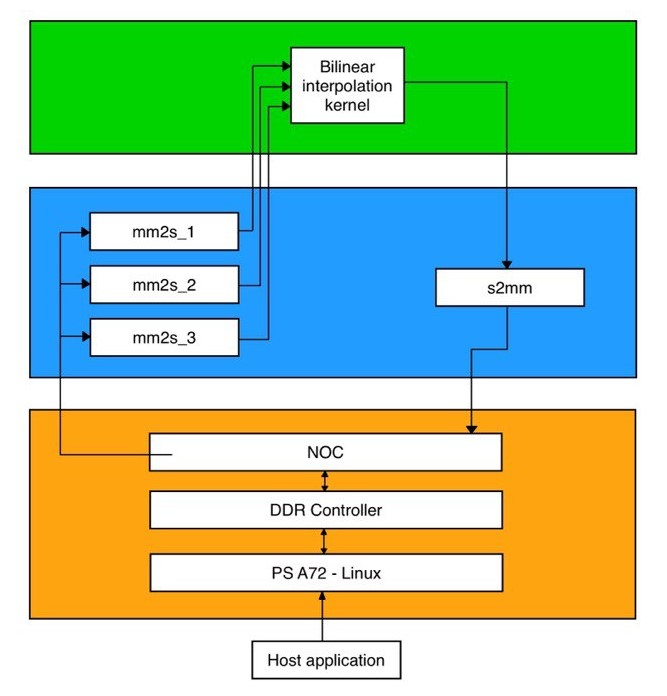

# Bilinear Interpolation

***Version: Vitis 2024.1***

## Table of Contents

1. [Introduction](#introduction)
2. [Tutorial Overview](#tutorial-overview)
3. [Section 1: Compile AI Engine Code using the AI Engine Compiler for `x86simulator](#section-1)
4. [Section 2: Simulate the AI Engine Graph using the `x86simulator`](section-2)
5. [Section 3: Compile and Run Software Emulation](#section-3)
6. [Section 4: Compile AI Engine Code for AIE Simulator](#section-4)
7. [Section 5: Simulate the AI Engine Graph using the `aiesimulator`](#section-5)
8. [Section 6: Build and Run on Hardware](#section-6)

[References](#references)


## Introduction

This tutorial shows how to create a system design running on the AIE-ML Engine, PS, and Programmable Logic(PL). The AI Engine domain contains the bilinear interpolation graph that has been used in the Bilinear Interpolation tutorial:

https://github.com/FraancescaFranzese/Vitis-Tutorials/tree/2024.2/AI_Engine_Development/AIE-ML/Design_Tutorials/11_Bilinear_Interpolation

The PL domain contains interfaces that provide input and capture output from the AI Engine. The PS domain contains a host application that controls the entire system. Indeed, the purpose of the tutorial is to show how to access an AI Engine kernel from the operating system.
This tutorial steps are: software emulation, hardware emulation, and hardware flow. By default, the Makefile is set for software emulation (`sw_emu`). If you need to build for hardware or hardware emulation (`hw` or `hw_emu`), use the corresponding TARGET option as described in corresponding sections.

IMPORTANT: Before beginning the tutorial ensure you have installed Vitis" 2024.1 software. The software includes all the embedded base platforms including the VEK280 base platform that is used in this tutorial. In addition, ensure you have downloaded the Common Images for Embedded Vitis Platforms from this link.

https://www.xilinx.com/support/download/index.html/content/xilinx/en/downloadNav/embedded-platforms/2024.1.html

The 'common image' package contains a prebuilt Linux kernel and root file system that can be used with the Versal board for embedded design development using Vitis. Before starting this tutorial run the following steps:

Navigate to the directory where you have unzipped the Versal Common Image package.
In a Bash shell, run the /Common Images Dir/xilinx-versal-common-v2024.1/environment-setup-cortexa72-cortexa53-xilinx-linux script. This script sets up the SDKTARGETSYSROOT and CXX variables. If the script is not present, you must run the /Common Images Dir/xilinx-versal-common-v2024.1/sdk.sh.
Note : This tutorial demonstrates how software emulation can run the PS application on an x86 process instead of an Arm process(QEMU). So, you may need to unset the CXX variable during the step Running software emulation. More information is provided in the software emulation flow section.

Set up your ROOTFS, and IMAGE to point to the rootfs.ext4 and Image files located in the /Common Images Dir/xilinx-versal-common-v2024.1 directory.
Set up your PLATFORM_REPO_PATHS environment variable to $XILINX_VITIS/base_platforms/xilinx_vck190_base_202410_1/xilinx_vck190_base_202410_1.xpfm.
This tutorial targets VEK280 production board for 2024.1 version.

The whole project is based on two AMD-Xilinx tutorials, which can be found on Github at the following links:
https://github.com/FraancescaFranzese/Vitis-Tutorials/tree/2024.2/AI_Engine_Development/AIE/Design_Tutorials/11-Bilinear_Interpolation
https://github.com/FraancescaFranzese/Vitis-Tutorials/tree/2024.2/AI_Engine_Development/AIE/Feature_Tutorials/05-AI-engine-versal-integration

## Tutorial Overview

The design that will be used is shown in the following figure:



- The green area delimits the AIE-ML domain;
- The blue area is the PL domain;
- The orange area represents CIPS, NoC and DDR.

|Kernel|Type|Comment|
|  ---  |  ---  |  ---  |
|MM2S|HLS|Memory Map to Stream HLS kernel to feed input data from DDR to AI Engine kernel via the PL DMA.|
|Bilinear Interpolation Kernel|AI Engine| This kernel has a three input stream: each of them is used to collect two int16 values. There is a single output stream whose underlying samples are 16-bit elements.|
|S2MM|HLS|Stream to Memory Map HLS kernel to feed output result data from AI Engine kernel to DDR via the PL DMA.|


## Section 1: Compile AI Engine Code using the AI Engine Compiler for `x86simulator

### Compiling an AI Engine ADF Graph

The first step is to perform a functional simulation of the design to verify its behaviour. The x86 simulator runs exclusively on the tool development machine. This means its performance and memory use are defined by the development machine.
To compile the graph for x86 simulator, the target to be used is x86sim, use:

```bash
make aie
```

The generated output from `aiecompiler` is the `Work` directory, and the `libadf.a` file. This file contains the compiled AI Engine configuration, graph, and Kernel `.elf` files.

#### Vitis Analyzer Compile Summary

Vitis Analyzer is used to view the AI Engine compilation results. Below is the `graph.aiecompile_summary` file generated by the `aiecompiler`, which is located in the `Work` directory.

To open the summary file, use the following command:

`vitis_analyzer -a ./Work/graph.aiecompile_summary`

The **Summary** view displays compilation runtime,  version of the compiler used, the platform targeted, kernels created, and the exact command line used for the compilation.


## Section 2: Simulate the AI Engine Graph using the `x86simulator`

After the graph has been compiled, you can simulate your design with the `x86simulator` command. The x86 simulator is an ideal choice for testing, debugging, and verifying behavior because of the speed of iteration and the high level of data visibility it provides the developer. The x86 simulation does not provide timing, resource, or performance information.

To run simulation run the command:

```bash
make sim
```

## Section 3: Compile and Run Software Emulation

### 1. Compiling HLS Kernels using v++

To compile the `mm2s`, and `s2mm` PL HLS kernels, the `v++` compiler has been used, which command takes in an HLS kernel source and produces an `.xo` file.
To compile the kernels, run the following command:

```bash
make kernels
```

### 2. Use V++ to Link AI Engine and HLS Kernels with the Platform

After the AI Engine kernels, AI Engine graph, PL kernel, and HLS kernels have been compiled and simulated, you can use `v++` to link them with the platform to generate an `.xsa`.
At this point, it is important to tell the linker how to connect the different kernel together (from the AI Engine array to PL and viceversa). These connections are described in a configuration file: `system.cfg`, which is shown below:

```ini
[connectivity]
nk=s2mm:1:s2mm_1
nk=mm2s:3:mm2s_1.mm2s_2.mm2s_3
stream_connect=mm2s_1.s:ai_engine_0.DIN_0_A
stream_connect=mm2s_2.s:ai_engine_0.DIN_0_B
stream_connect=mm2s_3.s:ai_engine_0.DIN_0_C
stream_connect=ai_engine_0.DOUT_0:s2mm_1.s
```

| Option/Flag | Description |
| --- | --- |
| `nk` | Specifies the number of instantiations of the kernel. For example, `nk=mm2s:3:mm2s_1.mm2s_2.mm2s_3` means that the kernel `mm2s` will instantiate three kernels, with the name `mm2s_1`, `mm2s_2`, `mm2s_3` respectively.|
| `stream_connect/sc` | Specifies the streaming connections to be made between PL/AI Engine or PL/PL. It should always be an output of a kernel to the input of a kernel.|

For `ai_engine_0` the names of the ports are the same provided in the `bilinear_graph.h`.
To build the design run the follow command:

```bash
make xsa
```

### 3. Compile the A72 Host Application

Once the `.xsa` has been generated, the host application is compiled using g++. The host code uses [XRT](http://www.github.com/Xilinx/XRT) (Xilinx Run Time) as an API to talk to the AI Engine and PL kernels. Let's have a look to the `host.cpp` code.

After a check on the number of argument, the host application opens the XCLBIN file, which contains the bitstream for the PL and the executables for AIE array.

```cpp
char* xclbinFilename = argv[1];
unsigned dev_index = 0;
auto my_device = xrt::device(dev_index);

if(!my_device){
	std::cout << "Device open error!" << std::endl;
}else{
	std::cout << "Device open OK!" << std::endl;
}

auto xclbin_uuid = my_device.load_xclbin(xclbinFilename);
```

Then the PS code allocates buffers for `mm2s` and `s2mm` kernels. An example is shown below.

```cpp
auto in_bo1 = xrt::bo(my_device, DDR_BUFFSIZE_I_BYTES, 0);
auto in_bo1_mapped = in_bo1.map<uint16_t*>();
memcpy(in_bo1_mapped, v_input_A, DDR_BUFFSIZE_I_BYTES);
in_bo1.sync(XCL_BO_SYNC_BO_TO_DEVICE);

...

auto out_bo = xrt::bo(my_device, DDR_BUFFSIZE_O_BYTES, 0);
auto out_bo_mapped = out_bo.map<uint16_t*>(); //puntatore alla memoria
memset(out_bo_mapped, 0x0000, DDR_BUFFSIZE_O_BYTES);  
    
```
`xrt::bo()` is used to allocate a buffer object. The second argument specifies the buffer size, and the third is used to specify the enumerated memory bank index where the buffer should be allocated.
The API `xrt::bo::map()` allows mapping the host-side buffer backing pointer to a user pointer: using this pointer it is possible to copy the input data inside the allocated buffer. Note also that `in_bo1.sync(XCL_BO_SYNC_BO_TO_DEVICE)` is used to synchronize data transfer between the host and the device.

After that, the host app can start input and output kernels:

```cpp
auto s2mm_k = xrt::kernel(my_device, xclbin_uuid, "s2mm:{s2mm_1}");
auto s2mm_r = s2mm_k(out_bo, nullptr, DDR_BUFFSIZE_O_BYTES/sizeof(int32));
std::cout << "s2mm run started" << std::endl;

...

auto mm2s_k3 = xrt::kernel(my_device, xclbin_uuid, "mm2s:{mm2s_3}");
auto mm2s_r3 = mm2s_k3(in_bo3,  nullptr, DDR_BUFFSIZE_I_BYTES/sizeof(int32));
std::cout << "mm2s3 run started" << std::endl;
```

`xrt::kernel()` is used to create a kernel class object from currently loaded xclbin. After the instantiation, the kernel can be executed. In this case, the parameters to be specified are the corresponding memory buffer and the number of iteration of the kernel. For example, in the case of the output kernel, the output buffer size is DDR_BUFFSIZE_O_BYTES, and the kernel input width is 32 bits. For this reason, the number of iteration to consume all the data is DDR_BUFFSIZE_O_BYTES/sizeof(int32).

Then, the graph is started:

```cpp

auto my_graph  = xrt::graph(my_device, xclbin_uuid, "blint");
my_graph.run(NRUN);
my_graph.end();

```

In this portion of the code, an `xrt::graph` object is opened using the uuid of the currently loaded XCLBIN file. Also the name of the graph must be specified. The graph can be executed for a fixed number of iteration by `xrt::graph::run()` API using an iteration argument. Then, `xrt::graph::end()` API is used to wait until graph execution is completed.

At the end, the application waits for kernels completion, and syncs output memory:

```cpp

mm2s_r1.wait();
mm2s_r2.wait();
mm2s_r3.wait();

s2mm_r.wait();
out_bo.sync(XCL_BO_SYNC_BO_FROM_DEVICE);

```

**Note:** [XRT](https://xilinx.github.io/XRT/master/html/xrt_native_apis.html) is used in the host application. This API layer is used to communicate with the PL, specifically the PLIO kernels for reading and writing data. To understand how to use this API in an AI Engine application refer to ["Programming the PS Host Application"](https://docs.amd.com/r/en-US/ug1076-ai-engine-environment/Host-Programming-on-Linux). 


The linker it is using the library `-lxrt_coreutil`.To compile the host code, it is required to use the c++17 package. Ensure your `gcc` or `g++` compiler has the necessary packages installed.

**Note**: XRT needs to be installed on the host and the $XILINX_XRT variable should be set by sourcing the `/opt/xilinx/xrt/setup.sh`.

Before starting the compilation, unset the CXX variable that points to the aarch64-linux-gnu-g++ compiler:

```bash
     unset CXX
```
Then run the command:

```bash
     make host
```

### 4. Package the Design

Now that the platform has been created, it is possible to generate the packaged SD card directory containing everything to run the generated application and the `.xclbin` file. In addition to packaging, the `emconfigutil` command is used to generate the device, board, and device tree details (emconfig.json) which are required by XRT before loading the xclbin.

To package the design, run the following command:

```bash
make package
```

### 5. Run Software Emulation

After packaging everything is set to run emulation. Software emulation is an abstract model and first step to build and test the system in a functional process. It does not use any of the PetaLinux drivers such as Zynq OpenCL (ZOCL), interrupt controller, or Device Tree Binary (DTB). Hence, the overhead of creating an sd_card.img, and booting PetaLinux on a full QEMU machine is too heavyweight for software emulation and can be avoided.

To run emulation use the following command:

```bash
make run_emu 
```
Simulation takes some time. At the end of the process, you should see on the screen:

// INSERIRE IMMAGINE


## Section 4: Compile AI Engine Code for AIE Simulator

### **Important**

If you have performed the steps for **Software Emulation**, ensure you follow the guidance below. If not, you can skip this step and proceed to 'Compiling an AI Engine Graph'.

1. Set back the `SYSROOT` and `CXX` variables as mentioned in the **Introduction**.
2. Clean the `Working` directory to remove all the files that are related to the software emulation by running the following command:

```bash
make clean
```

### Compiling an AI Engine ADF Graph for V++ Flow

To compile the graph type to be used in either HW or HW_EMU, use:

```bash
make aie TARGET=hw
```

The generated output from `aiecompiler` is the `Work` directory, and the `libadf.a` file. This file contains the compiled AI Engine configuration, graph, and Kernel `.elf` files.

#### Vitis Analyzer Compile Summary

Vitis Analyzer is used to view the AI Engine compilation results. It highlights the state of compilation, displays the graph solution in both the **Graph** and **Array** views, provides guidance around the kernel code, and allows you to open various reports produced by `aiecompiler`. Below is the `graph.aiecompile_summary` file generated by the `aiecompiler`, which is located in the `Work` directory.

To open the summary file, use the following command:

`vitis_analyzer -a ./Work/graph.aiecompile_summary`

## Section 5: Simulate the AI Engine Graph using the `aiesimulator` 

After the graph has been compiled, you can simulate your design with the `aiesimulator` command. This uses a cycle-approximate model to test your graph and get preliminary throughput information early in the design cycle, while the PL developers continue to work on the platform for the application.

To run simulation use the command:

```bash
make sim TARGET=hw
```
    
### 1. Compiling HLS Kernels Using v++

As done for sw_emu target in **Section 3**, compile the `mm2s`, and `s2mm` PL HLS kernels using the `v++` compiler command - which takes in an HLS kernel source and produces an `.xo` file.

To compile the kernels, run the following command:

```bash
make kernels TARGET=hw_emu
```

### 2. Use V++ to Link AI Engine, HLS Kernels with the Platform

After the AI Engine kernels, graph, PL kernel, and HLS kernels have been compiled and simulated, you can use `v++` to link them with the platform to generate an `.xsa`.
To build the design, run the following command:

```bash
make xsa TARGET=hw_emu
```

Now you have a generated `.xsa` that will be used to execute your design on the platform.

### 3.Compile the A72 Host Application

Note: Unlike the software emulation where we used a g++ compiler to compile the host application, you use Arm cross-compiler `aarch64-xilinx-linux-g++` in hardware emulation. If you have exercised the software emulation step, please make sure to setback the `SYSROOT` and `CXX` variables as mentioned in the **Introduction**.

To compile the A72 host application, run the command:

```bash
make host TARGET=hw_emu
```

### 4.Package the Design

With all the AI Engine outputs and the new platform created, you can now generate the Programmable Device Image (PDI) and a package to be used on an SD card. The PDI contains all executables, bitstreams, and configurations of every element of the device. The packaged SD card directory contains everything to boot Linux and have your generated application, and `.xclbin`.

To package the design, run the following command:

```bash
make package TARGET=hw_emu
```
**NOTE:** By default the `--package` flow will create a `a.xclbin` automatically if the `-o` switch is not set

    
### 5.Run Hardware Emulation

After packaging, everything is set to run emulation.
To run emulation use the following command:

```bash
make run_emu TARGET=hw_emu
```

To terminate emulation, press `Crtl+A` followed by `X`.

## Section 6: Build and Run on Hardware

To build for hardware, run the following command:

```bash
make xsa TARGET=hw
```

Then re-run the packaging step with:

```bash
make package TARGET=hw
```
When you run on hardware, ensure you have a supported SD card. Format the SD card with the `sw/sd_card.img` file. Then plug the SD card into the board and power it up.
When a Linux prompt appears, run the following commands:

```bash
dmesg -n 4 && echo "Hide DRM messages..."
cd /run/media/*1
export XILINX_XRT=/usr
./host.exe a.xclbin
```

You should see **TEST PASSED**. You have successfully run your design on hardware.

**IMPORTANT**: To re-run the application you need to power cycle the board.


## References

[XRT]:<https://xilinx.github.io/XRT/master/html/index.html> "Xilinx Runtime documentation"

[[XRT]]: Xilinx Runtime. © Copyright 2017-2023, Advanced Micro Devices, Inc. Last updated on October 7, 2022.

