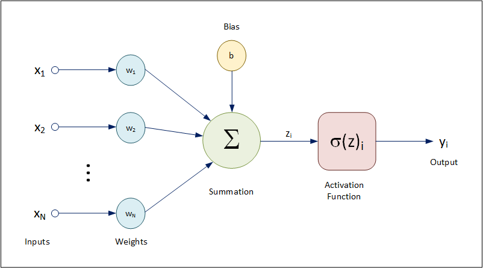
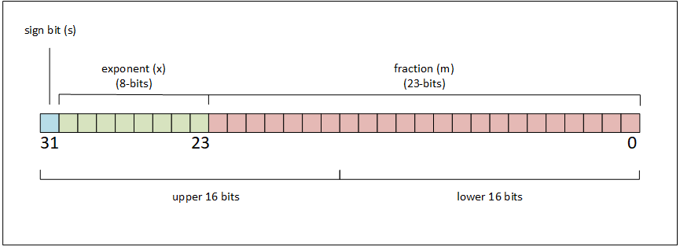
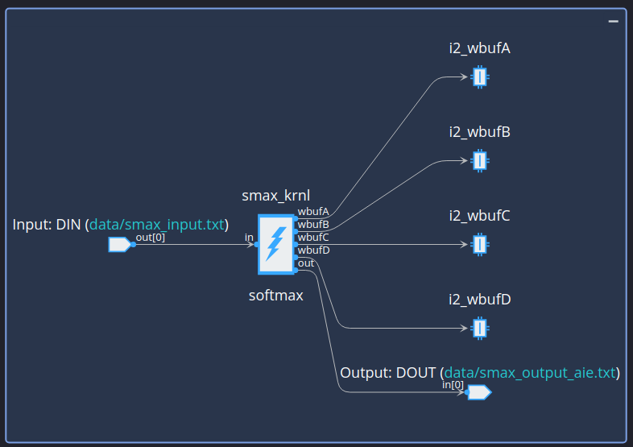
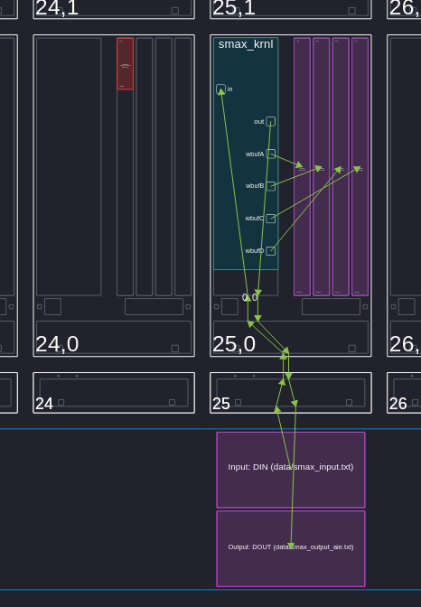

<!--
Copyright (C) 2024, Advanced Micro Devices, Inc. All rights reserved.
SPDX-License-Identifier: MIT
Author: Richard Buz
-->
<table class="sphinxhide" width="100%">
 <tr width="100%">
    <td align="center"><h1>AI Engine Development</h1>
    <a href="https://www.xilinx.com/products/design-tools/vitis.html">See Vitis™ Development Environment on xilinx.com</br></a>
    <a href="https://www.xilinx.com/products/design-tools/vitis/vitis-ai.html">See Vitis™ AI Development Environment on xilinx.com</a>
    </td>
 </tr>
</table>

# Softmax Function

***Version: Vitis 2024.2***

## Table of Contents

- [Softmax Function](#softmax-function)
  - [Table of Contents](#table-of-contents)
  - [Introduction](#introduction)
  - [Softmax Function Definition](#softmax-function-definition)
  - [Computing the Exponential Function](#computing-the-exponential-function)
    - [IEEE 754 Format Trick](#ieee-754-format-trick)
    - [Improving Accuracy](#improving-accuracy)
    - [Adapting for Single-Precision Floating-Point](#adapting-for-single-precision-floating-point)
  - [AI Engine Implementation](#ai-engine-implementation)
  - [AI Engine Kernel Processing](#ai-engine-kernel-processing)
    - [Kernel Data Interface](#kernel-data-interface)
    - [Kernel Code](#kernel-code)
  - [Running the Example](#running-the-example)
    - [Generating Test Vectors](#generating-test-vectors)
    - [Running x86 Simulation](#running-x86-simulation)
    - [Running AI Engine Simulation](#running-ai-engine-simulation)
  - [Analyzing Results](#analyzing-results)
    - [Vitis Analyzer](#vitis-analyzer)
    - [Test Vector Comparison](#test-vector-comparison)
  - [References](#references)
  - [Support](#support)
  - [License](#license)

[References](#references)

[Support](#support)

[License](#license)

## Introduction
Machine Learning is pervasive in just about any modern application. Whereas machine learning tends to infer processing of structured data, the sub-class of deep learning is often applied to unstructured data where more abstraction is required to extract significant features from a data set. Some applications which have proven to benefit from the application of deep learning are natural language processing and image classification, where the relationship between input data and desired output can be exceedingly complex.

Deep learning solutions are often created in the form of a neural network, as depicted in the following figure.


*Figure 1 - Artificial Neural Network*

An artificial neural network is comprised of layers of neurons intended to mimic behavior of the human brain. Each layer consists of nodes which are connected to adjacent layers. The number of nodes in a layer and number of hidden layers can vary depending on implementation. Nodes in the graph represent individual neurons which may be depicted in more detail as shown in the following figure.



*Figure 2 - Artificial Neuron*

Input data to each layer is multiplied by a weight before being summed together. These weights are determined by training the neural network using empirical data. The activation function transforms the weighted sum of inputs into an output signal. Activation functions add non-linearity to neural networks, enabling them to effectively approximate any complex function of the input data. Different types of activation functions are available to use within the various layers of the neural network. An activation function often applied to the output layer is known as softmax.

## Softmax Function Definition

The softmax function is defined for a vector of real values $\mathbf{z} = \left( z_1, z_2, \ldots , z_M \right)$ by the equation

$$
\Large {\sigma \left( \mathbf{z} \right) {\small i}} = {\frac{e^{z_i}}{\sum\nolimits_{j=1}^{M} e^{z_j}}}
$$

where $z_i$ are the individual outputs of the layer. Softmax differs from other popular activation functions in that it takes into account the entire layer and scales outputs so they sum to a value of 1. Each individual output can then be interpreted as a probability. So in classification problems, softmax output may be interpreted as probability that the input data belongs to a specified class.

When computing the softmax function, there is a risk of overflow occurring during evaluation of the individual exponential functions that comprise the formula. For single-precision floating-point numbers, the exponential function overflows when input values exceed ~88.723. To avoid overflow, the softmax function is often evaluated using the equivalent formula

$$
\Large {\sigma \left( \mathbf{z} \right) {\small i}} = {\frac{e^{z_i - \alpha}}{\sum\nolimits_{j=1}^{M} e^{z_j- \alpha}}}
$$

where $\alpha$ is a real-valued constant. In particular, $\alpha$ is often chosen to be the maximum of all $z_i$ values comprising the input vector. By subtracting the maximum value from all others, inputs to the exponential functions are constrained to the range $(-\infty, 0]$, which in turn limits the exponential function values to the range $[0, 1]$.

Another alternative to evaluating the softmax function is to use the equivalent formula

$$
\Large {\sigma \left( \mathbf{z} \right) {\small i}} = \exp \left( z_i - \log \sum\nolimits_{j=1}^{M} e^{z_j} \right)
$$

which is attractive because no division is required. However, it has been shown that in practice this formula tends to produce larger computational errors [[1]].

## Computing the Exponential Function
### IEEE 754 Format Trick
In addition to basic arithmetic operations, softmax computation depends on efficient evaluation of the exponential function. While there are several ways to accomplish this, an attractive alternative is to estimate the exponential function using a trick based on IEEE 754 floating-point format [[2]]. A double-precision, floating-point number represented by IEEE 754 format is shown in the following figure.


*Figure 3 - IEEE 754 Format for Double-Precision Numbers*

This format is used to represent a number $(-1)^s(1+m)2^{x-x_0}$, where $s$ is a sign bit, $m$ is the 52-bit fractional part of a normalized mantissa, and $x$ is an 11-bit exponent with bias $x_0 = 1023$.

Approximation is based on the identity $e^y = 2^{y/log(2)}$. So for any floating-point number $y$, the value $e^y$ is approximated by setting the exponent $x$ of the result to $y/log(2) + x_0$. To perform the computation, it helps to divide a double precision number into two groups comprised of upper 32 bits and lower 32 bits. The lower 32 bits are set to 0 in this approximation, while the upper 32 bits are the same bits used to represent the signed 32-bit integer value

$$
I_{upper} = \left\lfloor \frac{2^{20}y}{log(2)} + 2^{20}x_0 - C \right\rfloor .
$$

A factor of $2^{20}$ represents a binary shift necessary to align with the exponent field of the IEEE 754 format. Residual mantissa bits help provide a degree of interpolation between exponent values. The parameter $C$ is a correction factor meant to mitigate estimation error. It was found that a value of $C=60801$ minimizes RMS error [[2]]. This estimation method may be adapted for other variations of floating-point number representations, such as 32-bit single-precision floating-point. 

### Improving Accuracy
While this trick is computationally very efficient, it can result in an estimation error as large as 4% of the true value. To reclaim lost accuracy, a method was proposed in [[3]] where all 64 bits are used in computation and a correction function $F$ is defined. To derive the solution, begin by expressing the exponential function in the form

$$
e^y = 2^{y/log(2)} = 2^{y_{i}} \cdot 2^{y_{f}} \approx 2^{y_{i}} \cdot \left( 1 + m - F \right),
$$

where $y_i$ and $y_f$ are the integer and fractional parts of $y/log(2)$, respectively. The correction function is defined by solving for $F = 1 + m - 2^{y_{f}}$. Since $m \equiv y_{f}$, an equivalent expression is $F \left( y_{f} \right) = 1 + y_{f} - 2^{y_{f}}$. The correction function $F \left( y_f \right)$ may be modeled as a polynomial, where $y_f$ is defined over the range $[0, 1)$.

The exponential function estimate is obtained by computing

$$
I = \left\lfloor \frac{2^{52}}{log(2)} \left( y - log(2) F(y_f) \right) + 2^{52}x_0 \right\rfloor
$$

as a 64-bit signed integer then reinterpreting the result as a double-precision floating-point value. Since all 64 bits are used, a factor $2^{52}$ is necessary to align to the exponent field of the IEEE 754 format.

### Adapting for Single-Precision Floating-Point
AMD Versal&trade; Core Adaptive SoCs primarily contain a variant of AI Engine processor which has single-precision floating-point as a native data type. A single-precision floating-point format, known as binary32, is specified by the IEEE 754 standard as shown in Figure 4.



*Figure 4 - IEEE 754 Single-Precision Floating-Point Format*

This format is structurally similar to double-precision format, but with reduced dynamic range and precision due to fewer bits being used to represent the exponent and mantissa. To adapt exponential function approximation to single-precision floating-point data types, the equation becomes

$$
I = \left\lfloor \frac{2^{23}}{log(2)} \left( y - log(2) F(y_f) \right) + 2^{23}x_0 \right\rfloor
$$

where $x_0 = 127$ and $I$ is computed as a signed 32-bit integer which is then reinterpreted as single-precision floating-point.

The correction function $F(y_f)$ may be approximated with a polynomial. As an example, the polynomial $p(x) = p_4 x^4 + p_3 x^3 + p_2 x^2 + p_1 x + p_0$ with $p_4 = -1.367030945e^{-2}$, $p_3 = -5.174499750e^{-2}$, $p_2 = -2.416043580e^{-1}$, $p_1 = 3.070270717e^{-1}$, and $p_0 = -3.492907808e^{-6}$ was obtained through Chebyshev approximation. Polynomials with degree greater than 4 appear to offer no additional benefit when computing with single precision. Utilizing this polynomial as the correction function results in approximation of the exponential function having a maximum error of less than 0.0015%. 

For comparison, another version of [Softmax Function Tutorial](../../../AIE-ML/Design_Tutorials/05-Softmax-Function/) is available for the AIE-ML variant of AI Engines, where bfloat16 is the native floating-point data type. 

## AI Engine Implementation

One of the key parameters impacting the amount of computation required for evaluating the softmax function is the number of classes. For the example presented here, 2048 classes are used to represent the output nodes of a neural network. Since data is in single-precision floating-point format, the floating-point vector unit of the AI Engine, shown in the following figure, is required. The floating-point multiply unit is designed to process vectors with eight lanes, so softmax computation is designed to accommodate a SIMD factor of eight.


*Figure 5 - AI Engine Floating-Point Vector Unit*

From the preceding figure, you can observe that the floating-point vector processor has a pipeline depth of seven. To improve compute efficiency, kernel processing should be designed to keep the pipeline full. This is not the case when a computation needs to wait for intermediate results to proceed. To take full advantage of software pipelining, computation is broken up into components, where intermediate results are stored in data memory. Each loop in the kernel processes a specific computation for the entire number of classes in the softmax function, eight elements at a time. Each invocation of the kernel computes a single softmax vector comprising the values for all outputs according to the following processing order:

1. Read and store all input values while searching for the maximum value. (single loop)
2. Compute exponential function of all values. (10 computational loops, includes subtraction of maximum from input and correction polynomial evaluation)
3. Sum all exponentials and invert sum to obtain scaling factor. (single loop plus scalar processor inverse operation)
4. Multiply all exponentials by scaling factor and send result to output. (single loop)

## AI Engine Kernel Processing

### Kernel Data Interface

While this kernel is designed for single-precision floating-point processing, the function signature indicates that data type at the interface is `int32` for both input and output.

```cpp
void softmax_kernel::softmax(input_stream<int32>* in, output_stream<int32>* out)
```
Each of these `int32` values represents the 32-bits of a single-precision floating-point value in IEEE 754 format. When used by the kernel, values are reinterpreted as floating-point for processing. The reason for this is that when performing AI Engine simulation, text files are used for input and output of data. Use of `int32` preserves all bits of the floating-point number when read from or written to a text file and allows for test vector matching at the bit level.

Also of note is that streaming interfaces are used for input and output, which reduces latency and eliminates the need for ping pong buffers in data memory.

### Kernel Code

The first processing loop of the kernel is shown below. Note that iterators are defined for work buffers specified in data memory to hold intermediate results. The processing loop reads input values for softmax computation and stores them to memory while searching for the maximum input value.

```cpp
// work buffers in data memory
auto pWbufA = aie::begin_restrict_vector<8>(wbufA);
auto pWbufB = aie::begin_restrict_vector<8>(wbufB);
auto pWbufC = aie::begin_restrict_vector<8>(wbufC);
auto pWbufD = aie::begin_restrict_vector<8>(wbufD);

// read and store data while searching for maximum value
float max_val = -2 ^ 127;

for (unsigned i=0; i < BUFFSZ/8; i++) 
    chess_prepare_for_pipelining
    chess_loop_count(BUFFSZ/8)
{
    aie::vector<float,8> vin = aie::vector_cast<float>(readincr_v<8>(in));
    float vmax = aie::reduce_max(vin);
    if (vmax > max_val) {
        max_val = vmax;
    }
    *pWbufB++ = vin;
}

pWbufB -= (BUFFSZ/8);

chess_separator();
```

The next segment of kernel code, as shown below, is comprised of the first three computational loops used to evaluate the exponential function of all inputs. The first loop subtracts the maximum value from all inputs then multiplies the result by a scale factor of $\log_{2}e$, which is equivalent to $\frac{1}{\log(2)}$. The scale factor is defined in the kernel header file. The second loop computes `floor()` of the scaled values. Since conversion to fixed-point utilizes a rounding function, a value of 0.5 is subtracted first, to make the output equivalent to `floor()`. One caveat is that this does not compute `floor()` for very small, negative values. The third loop computes the fractional value $x - \lfloor x \rfloor$. Iterators for data memory are reset after each loop to prepare them for follow-on processing.

```cpp
/****** Start of computation of exponential function of all input values ******/
// subtract maximum value from all input values and scale result by log2(e)
aie::accum<accfloat,8> acc_init;
acc_init.from_vector(aie::broadcast<float,8>(-log2e*max_val));

for (unsigned i=0; i < BUFFSZ/8; i++)
    chess_prepare_for_pipelining
    chess_loop_count(BUFFSZ/8)
{
    *pWbufA++ = aie::mac(acc_init, *pWbufB++, log2e);
}

pWbufA -= (BUFFSZ/8);
pWbufB -= (BUFFSZ/8);

chess_separator();

// compute integer part of scaled inputs, equivalent to floor()
// Note: Not strictly a floor(), fails for negative numbers with very small magnitudes
for (unsigned i=0; i < BUFFSZ/8; i++) 
    chess_prepare_for_pipelining
    chess_loop_count(BUFFSZ/8)
{
    aie::vector<float,8> vecA = aie::vector_cast<float>(*pWbufA++);
    aie::vector<float,8> xshft = aie::sub(vecA, 0.5f);
    aie::vector<int32,8> xfloor = aie::to_fixed(xshft,0);
    *pWbufC++ = aie::to_float(xfloor);
}

pWbufA -= (BUFFSZ/8);
pWbufC -= (BUFFSZ/8);

chess_separator();

// compute the fractional part of scaled input
for (unsigned i=0; i < BUFFSZ/8; i++) 
    chess_prepare_for_pipelining
    chess_loop_count(BUFFSZ/8)
{
    *pWbufB++ = aie::sub(*pWbufA++, *pWbufC++);
}

pWbufA -= (BUFFSZ/8);
pWbufB -= (BUFFSZ/8);
pWbufC -= (BUFFSZ/8);

chess_separator();
```

The next four loops are used to evaluate the correction polynomial using Horner's method. Polynomial coefficients are specified in the kernel header file.

```cpp
/****** Start of correction polynomial computation ******/
// using Horner's method, break polynomial evaluation into separate loops for improved pipelining

// polynomial loop 1
aie::accum<accfloat,8> p_acc;
p_acc.from_vector(aie::broadcast<float,8>(p3));

for (unsigned i=0; i < BUFFSZ/8; i++) 
    chess_prepare_for_pipelining
    chess_loop_count(BUFFSZ/8)
{
    *pWbufC++ = aie::mac(p_acc, *pWbufB++, p4);
}

pWbufB -= (BUFFSZ/8);
pWbufC -= (BUFFSZ/8);

chess_separator();
  
// polynomial loop 2
p_acc.from_vector(aie::broadcast<float,8>(p2));

for (unsigned i=0; i < BUFFSZ/8; i++)
    chess_prepare_for_pipelining
    chess_loop_count(BUFFSZ/8)
{
    *pWbufD++ = aie::mac(p_acc, *pWbufB++, *pWbufC++);
}

pWbufB -= (BUFFSZ/8);
pWbufC -= (BUFFSZ/8);
pWbufD -= (BUFFSZ/8);

chess_separator();

// polynomial loop 3
p_acc.from_vector(aie::broadcast<float,8>(p1));

for (unsigned i=0; i < BUFFSZ/8; i++)
    chess_prepare_for_pipelining
    chess_loop_count(BUFFSZ/8)
{
    *pWbufC++ = aie::mac(p_acc, *pWbufB++, *pWbufD++);
}

pWbufB -= (BUFFSZ/8);
pWbufC -= (BUFFSZ/8);
pWbufD -= (BUFFSZ/8);

chess_separator();

// polynomial loop 4
p_acc.from_vector(aie::broadcast<float,8>(p0));

for (unsigned i=0; i < BUFFSZ/8; i++) 
    chess_prepare_for_pipelining
    chess_loop_count(BUFFSZ/8)
{
    *pWbufD++ = aie::mac(p_acc, *pWbufB++, *pWbufC++);
}

pWbufB -= (BUFFSZ/8);
pWbufC -= (BUFFSZ/8);
pWbufD -= (BUFFSZ/8);

/****** End of correction polynomial computation ******/

chess_separator();
```

Three more loops are used to complete evaluation of the exponential function of the inputs, as shown below. The first loop subtracts the correction polynomial result from the scaled input. The next loop scales and translates the result so that the exponent is aligned with IEEE 754 format and has the proper offset. Parameters used in computation are specified in the kernel header file. Finally, the integer part of the result is extracted and reinterpreted as a floating-point number. Before reinterpreting the number as floating-point, some checking is performed to ensure the `int32` value is reasonable to represent a `float` in the range $[0, 1]$, and any outliers are set to zero.

```cpp
// apply correction term to scaled input
for (unsigned i=0; i < BUFFSZ/8; i++) 
    chess_prepare_for_pipelining
    chess_loop_count(BUFFSZ/8)
{
    *pWbufB++ = aie::sub(*pWbufA++, *pWbufD++);
}

pWbufA -= (BUFFSZ/8);
pWbufB -= (BUFFSZ/8);
pWbufD -= (BUFFSZ/8);

chess_separator();

// convert results to IEEE 754 format - use 2 loops
aie::accum<accfloat,8> b_acc;
b_acc.from_vector(aie::broadcast<float,8>(exp_B));

for (unsigned i=0; i < BUFFSZ/8; i++) 
    chess_prepare_for_pipelining
    chess_loop_count(BUFFSZ/8)
{
    *pWbufC++ = aie::mac(b_acc,*pWbufB++,exp_S);
}

pWbufB -= (BUFFSZ/8);
pWbufC -= (BUFFSZ/8);

chess_separator();

for (unsigned i=0; i < BUFFSZ/8; i++) 
    chess_prepare_for_pipelining
    chess_loop_count(BUFFSZ/8)
{
    aie::vector<int32,8> exp_i = aie::to_fixed(*pWbufC++,0);

    // integer values should be in the range [0, 1,065,353,216], find outliers and set to zero
    aie::mask<8>  msk_neg = aie::lt(exp_i,0);
    aie::vector<int32,8> exp_bnd = aie::select(exp_i, aie::zeros<int32,8>(), msk_neg);
    aie::mask<8>  msk_pos = aie::gt(exp_bnd,1065353216);
    exp_bnd = aie::select(exp_bnd, aie::zeros<int32,8>(), msk_pos);

    *pWbufA++ = exp_bnd.cast_to<float>();
}

pWbufA -= (BUFFSZ/8);
pWbufC -= (BUFFSZ/8);

/****** End of computation of exponential functions of all input values ******/

chess_separator();
```

With the exponential function of all inputs computed, the softmax function is evaluated by the kernel code shown below. The first loop sums exponential values in individual vector lanes. Next, individual vector lanes are summed, and the scalar processor is invoked to compute a scale factor, which is the inverse of the sum. The final loop multiples all the exponential values by the scale factor and sends the result to output.

```cpp
// accumulate all vectors to determine scale factor
auto vsum = aie::zeros<float,8>();

for (unsigned i=0; i < BUFFSZ/8; i++) 
    chess_prepare_for_pipelining
    chess_loop_count(BUFFSZ/8)
{
    vsum = aie::add(vsum, *pWbufA++);
}

pWbufA -= (BUFFSZ/8);

chess_separator();

// compute inverse
float scl_fctr = aie::inv(aie::reduce_add(vsum));

// scale values and write to output
for (unsigned i=0; i < BUFFSZ/8; i++) 
    chess_prepare_for_pipelining
    chess_loop_count(BUFFSZ/8)
{
    aie::vector<float,8> vout = aie::mul(*pWbufA++, scl_fctr);
    writeincr(out, aie::vector_cast<int32>(vout));
}
```

## Running the Example

Running the example requires that both MATLAB and AMD Vitis™ tools are installed and configured correctly. After downloading the files, cd into the ``.../19-Softmax-Function/aie/`` directory and use the make build process.

### Generating Test Vectors

Prior to running the AI Engine graph simulation, test vectors are required to provide input. Scripts are also provided to compare with AI Engine simulator output for verification. To generate the vectors, run the command:

```bash
$ make gen_vectors
```

Test vectors are included with this tutorial, so this step isn't strictly necessary prior to AI Engine simulation. If desired, you can run the ``matlab/genvectors_softmax_aie_float32.m`` function from the MATLAB environment to generate test vectors. This function accepts input arguments specifying the number of softmax classes and the number of softmax vectors to generate. This function also creates a file ``aie/src/config.h`` which configures the AIE kernel and simulation to properly process the generated testvectors.

### Running x86 Simulation

To perform a functional x86 simulation, enter the following sequence of commands:

```bash
$ make x86com
$ make x86sim
$ make check_x86sim
```

The first command compiles graph code for simulation on an x86 processor, the second command runs the simulation, and the final command invokes MATLAB to compare the simulator output with test vectors.

### Running AI Engine Simulation

To perform the AI Engine emulation using the SystemC simulator, enter the following sequence of commands:

```bash
$ make aiecom
$ make aiesim
$ make check_aiesim
```

The first command compiles graph code for the SystemC simulator, the second command runs the simulation, and the final command invokes MATLAB to compare simulation output with test vectors. If it is desired to generate trace and profile data during simulation, use the sequence:

```bash
$ make aiecom
$ make profile
$ make check_aiesim
```

## Analyzing Results

### Vitis Analyzer

Vitis Analyzer is an essential tool for accessing information on compilation, simulation, and implementation of AI Engine graphs. It can be used to obtain a summary on profiling data and to graphically display trace events. The tool may be invoked with the ``vitis_analyzer`` command, or for this example, by entering:

```bash
$ make analyze
```

The Graph view displays connectivity of the AI Engine graph, which for this example, is displayed in the following figure. This simple example shows a softmax kernel with streaming data input and output. Also visible are four buffers in data memory used for holding intermediate computations.



*Figure 6 - Vitis Analyzer Graph View*

The Array view displays how the AI Engine graph is mapped to the AI Engine array for the device specified. This example uses a VC1902 Versal AI Core device, which contains 400 AI Engine tiles. As shown in the following figure, this example utilizes two AI Engine tiles. One tile is used for kernel processing along with containing work buffers in data memory. The amount of memory required for these buffers depends on the number of classes in the softmax function. For this example with 2048 classes, the entire 32 kB associated with the tile is utilized. This requires a second tile to accommodate system memory, shown in red.



*Figure 7 - Vitis Analyzer Array View*

The following figure contains information from the Profile view. The highlighted fields show that the softmax kernel takes 25,306 cycles to process 2048 classes. For lowest speed grade Versal devices, this would translate to a processing rate of ~39,516 softmax computations per second. Higher speed grade devices could have a peak rate of ~49,395 softmax computations per second.


*Figure 8 - Vitis Analyzer Profile View*

The following figure shows part of the Vitis Analyzer trace view. The cursors show that the time between the end of one kernel invocation to the end of the next is 20.256 $\mu s$. Additional overhead causes softmax computation rate to decrease slightly to ~49,368 computations per second in higher speed grade devices. This particular implementation is limited by computation efficiency. To improve processing rate, you can further optimize code, or possibly trade off accuracy by eliminating the polynomial correction factor from exponential function evaluation.


*Figure 9 - Vitis Analyzer Trace View*

### Test Vector Comparison

When comparing simulation results against test vectors, a MATLAB script is invoked to perform the processing. An example of a successful comparison is shown in the following figure.


*Figure 10 - Simulation Verification*

The output provides two different indications of simulation performance. The first is an indication of whether the simulation output matched corresponding test vectors. There is one comparison for each softmax function evaluated. The script compares `int32` values which represent single-precision floating-point softmax function values. Since there might be variation when comparing floating-point results, the comparison allows for mismatch in the least significant mantissa bit of the floating-point number. The number of allowed LSB mismatches might be adjusted in the MATLAB script.

The second comparison indicates the maximum difference between AI Engine simulation results and double-precision floating-point results generated by MATLAB processing. For each softmax computation, the maximum error is specified along with the two values compared. Also shown for each softmax computation is the summation of all terms, which should ideally be 1.0.

## References

[1]:<https://doi.org/10.1093/imanum/draa038> "Blanchard2021"
[[1]]: P. Blanchard, D. J. Higham, N. J. Higham, Accurately computing the log-sum-exp and softmax functions, IMA Journal of Numerical Analysis, Volume 41, Issue 4, October 2021, Pages 2311–2330.

[2]:<https://www.schraudolph.org/pubs/Schraudolph99.pdf> "Schraudolph2000"
[[2]]: N. N. Schraudolph, "A fast, compact approximation of the exponential function," *Neural Comput.*, vol. 12, no. 9, pp. 2009-2012, 2000.

[3]: <https://research.ibm.com/publications/fast-exponential-computation-on-simd-architectures> "Malossi2015"
[[3]]: A. C. I. Malossi, Y. Ineichen, C. Bekas and A. Curioni "Fast exponential computation on SIMD architectures," HiPEAC 2015 - 1st Workshop On Approximate Computing (WAPCO), Amsterdam, NL, 2015, doi: 10.13140/2.1.4362.3207.

## Support

GitHub issues will be used for tracking requests and bugs. For questions, go to [support.xilinx.com](http://support.xilinx.com/).

## License

Components: xilinx-images

images in the documentation

Components: xilinx-files

The MIT License (MIT)

Copyright (c) 2024 Advanced Micro Devices, Inc.

Permission is hereby granted, free of charge, to any person obtaining a copy
of this software and associated documentation files (the "Software"), to deal
in the Software without restriction, including without limitation the rights
to use, copy, modify, merge, publish, distribute, sublicense, and/or sell
copies of the Software, and to permit persons to whom the Software is
furnished to do so, subject to the following conditions:

The above copyright notice and this permission notice shall be included in all
copies or substantial portions of the Software.

THE SOFTWARE IS PROVIDED "AS IS", WITHOUT WARRANTY OF ANY KIND, EXPRESS OR
IMPLIED, INCLUDING BUT NOT LIMITED TO THE WARRANTIES OF MERCHANTABILITY,
FITNESS FOR A PARTICULAR PURPOSE AND NONINFRINGEMENT. IN NO EVENT SHALL THE
AUTHORS OR COPYRIGHT HOLDERS BE LIABLE FOR ANY CLAIM, DAMAGES OR OTHER
LIABILITY, WHETHER IN AN ACTION OF CONTRACT, TORT OR OTHERWISE, ARISING FROM,
OUT OF OR IN CONNECTION WITH THE SOFTWARE OR THE USE OR OTHER DEALINGS IN THE
SOFTWARE.

<p class="sphinxhide" align="center">  &copy; Copyright 2024 Advanced Micro Devices, Inc.</p>


