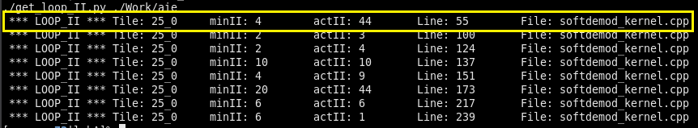
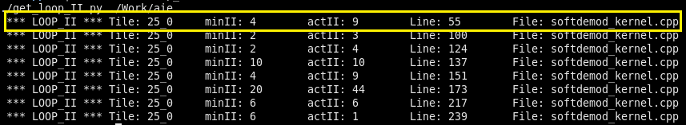
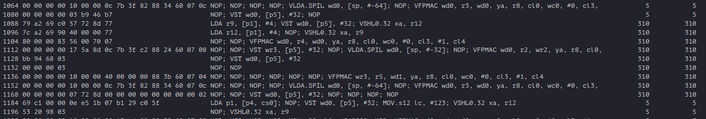
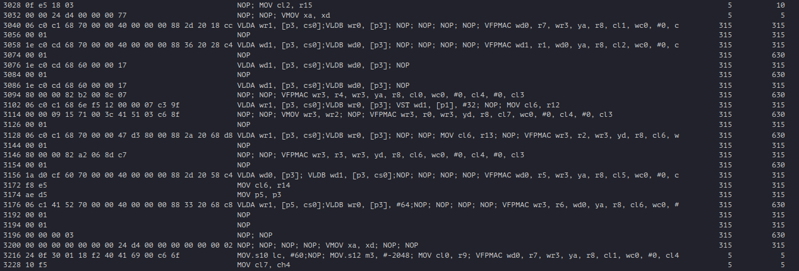

<!--
Copyright (C) 2024, Advanced Micro Devices, Inc. All rights reserved.
SPDX-License-Identifier: MIT
Author: Richard Buz
-->
<table class="sphinxhide" width="100%">
 <tr width="100%">
    <td align="center"><h1>AI Engine Development</h1>
    <a href="https://www.xilinx.com/products/design-tools/vitis.html">See Vitis™ Development Environment on xilinx.com</br></a>
    <a href="https://www.xilinx.com/products/design-tools/vitis/vitis-ai.html">See Vitis™ AI Development Environment on xilinx.com</a>
    </td>
 </tr>
</table>

# AI Engine Kernel Optimization Lab

***Version: Vitis 2024.2***

## Table of Contents

1. [Introduction](#introduction)
6. [DVB-S2 Soft Demodulator](#dvb-s2-soft-demodulator)
7. [Kernel Code](#kernel-code)
8. [Lab A Walkthrough](#lab-a-walkthrough)
9. [Lab B Walkthrough](#lab-b-walkthrough)

[References](#references)

[Support](#support)

[License](#license)

## Introduction
The purpose of this lab is to demonstrate how to improve compute efficiency of AI Engine kernels to optimize metrics such as throughput and latency. The primary tool used in diagnosing kernel source code is generated microcode, or assembly language. Becoming familiar with microcode basics allows designers to:
- Identify code loops which would benefit from optimization
- Diagnose typical causes of inefficient kernel code
- Devise appropriate solutions to improve efficiency

Kernel code used in this lab is based on an example design of a soft-decision demodulator, as is used in many digital communication applications.

## DVB-S2 Soft Demodulator

DVB-S2 is a second-generation satellite-based digital video broadcasting standard [1]. One of the key features of this standard is a powerful, adaptive coding and modulation scheme, which optimizes bandwidth utilization by dynamically changing transmission parameters. Four modulation schemes are included, which support varying numbers of bits per transmitted symbol. These are QPSK (2-bits), 8-PSK (3-bits), 16-APSK (4-bits), and 32-APSK (5-bits).

This lab will focus on AI Engine kernel code implementing a 16-APSK soft demodulator. Mapping of data bits to complex-valued baseband symbols is shown by the blue dots in the following diagram.


Data is segmented into groups of 4-bits and assigned a symbol. This symbol determines amplitude and phase of an RF carrier during the symbol transmission duration. At the receiver, distortion and noise cause symbols to be altered, which are represented as complex numbers in the plane. This is shown for a single symbol by a green dot in the figure. To determine the data bits associated with the received symbol, the demodulator could simply assume the most likely transmitted symbol (closest in distance) and select associated data bits from the mapping. This approach would result in an unacceptable error rate, impacting data link quality. The preferred approach is to use soft decisions, which provide a probabilistic measure of the likelihood that a received bit is a 1 versus a 0. This likelihood information is used in conjunction with a powerful LDPC error correcting code to provide reliable estimates and improved link performance.

Log-likelihood of a data bit $b$ is determined by the equation

$$L(b) = \log \left( \frac{Pr(b=0|r = (x,y))}{Pr(b=1|r = (x,y))} \right)$$

which is a ratio of the probability of a data bit being 0 given a received symbol $r=(x,y)$ to the probability of a data bit being 1 given the same received symbol. For 16-APSK, four LLRs are computed for each symbol. The sign of the LLR determines the value of the data bit, and the magnitude determines how reliable this assumption is.

Additive noise often has qualities that may be modeled using a Gaussian probability distribution. Based on this assumption, LLRs may be calculated with the formula

$$L(b) = \log \left( \frac{\displaystyle\sum_{s \in S_0} e^{-\frac{1}{\sigma^2}\left( \left( x - s_x \right)^2 + \left( y - s_y \right)^2 \right)}}{\displaystyle\sum_{s \in S_1} e^{-\frac{1}{\sigma^2}\left( \left( x - s_x \right)^2 + \left( y - s_y \right)^2 \right)}} \right)$$

where $s = (s_x, s_y)$ are constellation symbols, $S_0$ is the set of symbols with $b=0$, and $S_1$ is the set of symbols with $b=1$. For example, if $b$ is the LSB, then $S_0$ is the set of symbols in the top half of the constellation, and $S_1$ is the set of symbols in the bottom half. Variance of the additive noise is represented by $\sigma^2$.

## Kernel Code

Kernel code for computing log-likelihood ratios of data bits is contained in the file `softdemod_kernel.cpp`. Processing is divided into a sequence of 8 loops which perform the following computations:

| Loop Number | Loop Computation |
| :---------: | :-------------------------------------------------------------------- |
| 1 | Compute difference between received symbols and constellation points. |
| 2 | Compute squared magnitude of Loop 1 differences.                      |
| 3, 4, 5 | Compute estimate of exponential function of Loop 2 squared magnitudes weighted by negative inverse of noise variance. A trick based on IEEE 754 floating-point format is utilized. |
| 6 | Perform summing operation on exponentials for numerator and denominator of LLR equation. |
| 7 | Compute ratio of two sums computed by Loop 6, which is bit likelihood ratio. |
| 8 | Compute $log()$ function of Loop 7 outputs. To reduce unnecessary complexity for these labs, the $log()$ function is not implemented here, so this loop simply sends likelihood ratios to output. |

## Lab A Walkthrough

Lab A focuses on optimizing the first loop, which computes differences between complex-valued received symbols and a reference 16-APSK constellation. Source files may be found in `<path to repo>/labA/src/`. Open the file `softdemod_kernel.cpp` in a text editor and locate the first loop, as shown below.

```cpp
//-------------------------------------------------------------------------
// compute differences between received symbol and reference constellation
//-------------------------------------------------------------------------
// Begin section 1A
//-------------------------------------------------------------------------

// load reference constellation
aie::vector<cfloat,16> ref_const = aie::load_v<16>(constel); 

auto pIn = aie::begin(in);                              // input buffer
auto pwbufA16 = aie::begin_restrict_vector<16>(wbufA);  // store differences

// process all symbols in buffer
for (unsigned i = 0; i < BUFSZ; i++)
    chess_prepare_for_pipelining
    chess_loop_count(BUFSZ)
{
    // compute differences and store in memory buffer
    *pwbufA16++ = aie::sub(ref_const, *pIn++);
}
    
//-------------------------------------------------------------------------
// End section 1A
//-------------------------------------------------------------------------
```

Take a moment to understand what the code is doing. Next, open a terminal and `cd` to the `<path to repo>/labA/` directory. In order to verify the first loop is computing the desired result correctly, enter the following:

```bash
$ make x86com
$ make x86sim
$ make x86check
```

This compiles the design using the x86 compiler and runs a simulation to generate a data file containing output from the first loop. The final command executes a python script which reports how accurately the kernel computes results. You should observe something similar to the following:


Once kernel code is verified to be computing the first loop correctly, build the kernel for AI Engine by entering the following commands:

```bash
$ make aiecom
$ make loop_ii
```

The first command runs AIE compiler to build the design, and the other extracts II information from build logs. This lab uses a Python script to extract loop II but this is also easily accomplished using the [Vitis IDE](https://docs.amd.com/r/en-US/ug1079-ai-engine-kernel-coding/Viewing-Loop-II-in-the-Vitis-IDE). Once complete, the terminal should display something similar to:


There is a line for each loop in the kernel that displays minimum possible II, as determined by the compiler, and actual II. There is also information allowing you to locate the loop in a source code file. For the first loop, minimum II is 8 while actual II is 15. To obtain more insight, microcode will be examined. Run the following commands in a terminal:

```bash
$ make profile
$ make analyze
```

The first command runs AIE simulator to gather profile information. During simulation, the terminal displays a timer which should run to approximately 40 us until complete. The second command causes Vitis Analyzer to open after a brief delay. Once Vitis Analyzer opens, select Profile > Profile Details to display microcode. Locate the first loop in the kernel. It should look like the following:


Notice the presence of both VLDA.SPIL and VST.SPIL commands in the loop. This is an indication that register capacity is being exceeded and register content is being spilled to the stack during computation, leading to inefficiency. Re-examining the kernel source code, it appears that `cfloat` vectors of size 16 are being used for computation. Just one of these vectors occupies half of available register space, which explains why register spilling is occurring. You may close Vitis Analyzer when done.

Let's try to remedy this register spilling by using smaller vectors for computation. Comment out section 1A of the source code and uncomment section 1B. This should look like:

```cpp
//-------------------------------------------------------------------------
// Begin section 1B
//-------------------------------------------------------------------------
    
aie::vector<cfloat,4> ref_const;   // holds reference constellation symbols
auto pIn = aie::begin(in);                   // input buffer
auto pwbufA4 = aie::begin_vector<4>(wbufA);  // store differences

// process all symbols in buffer, one at a time
for (unsigned i = 0; i < BUFSZ; i++)
    chess_prepare_for_pipelining
    chess_loop_count(BUFSZ)
{
    // get received symbol
    auto rxsym = *pIn++;

    // 16-point constellation, compute 4 differences at a time
    //>>>>>>>>>>>>ENTER CODE HERE<<<<<<<<<<<<
}
    
//-------------------------------------------------------------------------
// End section 1B
//-------------------------------------------------------------------------  
```

The computation is setup to use `cfloat` vectors of size 4 and compute constellation differences using multiple subtraction operations. Complete the code where indicated to compute the required differences between received symbols and constellation. A solution is provided in the file `<path to repo>/labA/solution/softdemod_kernel_solution1.cpp`. Once source code changes are complete, accuracy of the computation may be verified by entering the commands:

```bash
$ make clean
$ make x86com
$ make x86sim
$ make x86check
```

Once functionality is verified, the design may be compiled for AI Engine implementation by entering the commands:

```bash
$ make aiecom
$ make loop_ii
```

When complete, the terminal should display something similar to the following:



Examining the first loop, minimum possible II has improved to 4, but actual II is 44. Something appears to have gone terribly wrong. Perhaps the microcode can provide insight? Run the following commands:

```bash
$ make profile
$ make analyze
```

Simulation should run until the counter indicates approximately 50 us. When Vitis Analyzer opens, examine the microcode for the first loop.


Notice that following some VLDA instructions there are a series of NOP lines until the register value is used in a subsequent VFPMAC operation. This indicates that the compiler was being cautious when assigning memory accesses. Since only a single buffer is being used, there is no danger of contention, so we can examine the code to see if there is a pointer which can be assigned a `restrict` qualifier. Examine the source code to identify a pointer which can be modified and make the change. A solution is provided in the file `<path to repo>/labA/solutions/softdemod_kernel_solution2.cpp`. Once changes are made, make sure Vitis Analyzer is closed and run the commands:

```bash
$ make clean
$ make aiecom
$ make loop_ii
```

which should result in something similar to:



Actual II is now down to 9, which is an improvement to the original implementation. Running the commands:

```bash
$ make profile
$ make analyze
```

and displaying microcode in Vitis Analyzer should display something similar to:



If further optimization is required, microcode may be examined for ideas on making improvements. Although the compiler states minimum II=4, it may be tough to achieve. Can you find a way to further improve efficiency?

## Lab B Walkthrough
The focus of Lab B is on computing summations of exponential functions used to determine the likelihood ratios for each data bit. These are the equations

$$\displaystyle\sum_{s \in S_0} e^{-\frac{1}{\sigma^2}\left( \left( x - s_x \right)^2 + \left( y - s_y \right)^2 \right)}$$ 

and 

$$\displaystyle\sum_{s \in S_1} e^{-\frac{1}{\sigma^2}\left( \left( x - s_x \right)^2 + \left( y - s_y \right)^2 \right)}$$ 

which are part of the LLR equation presented previously. For each data bit, the same group of exponential terms are used but the sets $S_0$ and $S_1$ differ.

The 4 data bits assigned to each baseband symbol may be converted into a decimal value and used to index each symbol in the constellation diagram presented previously. For example, the symbol that is assigned data bits 0000 is labeled $s_0$, the symbol assigned data bits 0001 is labeled $s_1$, the symbol assigned data bits 0010 is labeled $s_2$, and so on. Each of the terms

$$e^{-\frac{1}{\sigma^2}\left( \left( x - s_x \right)^2 + \left( y - s_y \right)^2 \right)}$$ 

is computed from the received symbol and one of the reference constellation symbols. Let $e_i$ denote the term computed using constellation symbol $s_i$ for $i \in 0, \ldots, 15$.

Input to the loop which computes the desired values for each symbol is a `float` vector of length 16. Organization of the $e_i$ terms in the vector is shown in the following figure.


Output of the loop is a `float` vector of length 8 containing summations over set $S_0$ and $S_1$ for each data bit. This format is shown below.


Constellation points used in the summations for each data bit are shown in the following figure, where green circles denote symbols comprising set $S_0$ and red circles denote symbols comprising set $S_1$ for each data bit.


The [AI Engine API](https://www.xilinx.com/htmldocs/xilinx2024_2/aiengine_api/aie_api/doc/index.html "AI Engine API") provides some functions which look to be ideal for this computation. The functions `filter_even()` and `filter_odd()` accept an input vector and produce an output vector half the size, extracting elements according to a specified pattern. For the sum of exponentials, input will be a vector of 16 `float` values and the output will be a vector of 8 `float` values representing the sums over $S_0$ and $S_1$ for each data bit. The other function of interest is `reduce_add()` which provides a summation of vector elements.

Source files for this lab are found in `<path to repo>/labB/src/`. Open the file `softdemod_kernel.cpp` in a text editor and locate the loop located in section 4A, as shown below.

```cpp
//-------------------------------------------------------------------------
// Begin section 4A
//-------------------------------------------------------------------------
// sum exponential components for 1 and 0 bit values according to 
// constellation mapping
//-------------------------------------------------------------------------

auto pwbufC16 = aie::begin_restrict_vector<16>(wbufC); // input exponentials

for (unsigned i = 0; i < BUFSZ; i++)
    chess_prepare_for_pipelining
    chess_loop_count(BUFSZ)
{
    aie::vector<float,8> expsum;  // holds exponentials sums
        
    expsum[0] = aie::reduce_add(aie::filter_even(*pwbufC16,  8));
    expsum[1] = aie::reduce_add(aie::filter_even(*pwbufC16,  4));
    expsum[2] = aie::reduce_add(aie::filter_even(*pwbufC16,  2));
    expsum[3] = aie::reduce_add(aie::filter_even(*pwbufC16,  1));
    expsum[4] = aie::reduce_add(aie::filter_odd( *pwbufC16,  8));
    expsum[5] = aie::reduce_add(aie::filter_odd( *pwbufC16,  4));
    expsum[6] = aie::reduce_add(aie::filter_odd( *pwbufC16,  2));
    expsum[7] = aie::reduce_add(aie::filter_odd( *pwbufC16++,1));
        
    *pwbufB8++ = expsum;
}
 
pwbufB8 -= BUFSZ;  // reset iterator for next loop

//-------------------------------------------------------------------------
// End section 4A
//-------------------------------------------------------------------------
```

Take a moment to examine the kernel code. Notice how AI Engine API functions provide a concise description of a fairly complicated addition process. In order to verify the design is performing computation correctly, `cd` to directory ``<path to repo>/labB`` and enter the following:

```bash
$ make x86com
$ make x86sim
$ make x86check
```

This compiles the design using x86 compiler and runs a simulation to functionally verify computations are performed correctly. The final command executes a python script which reports how accurately the kernel computes results. You should observe something similar to the following:


Since the design functions correctly, it can be compiled for AI Engine and analyzed using the commands:

```bash
$ make aiecom
$ make loop_ii
```

After entering these commands, you may observe something similar to the following:


The results are not as expected. There are 8 loops in the kernel, but only 7 are listed in the report. To get more insight, profile the code and examine resulting microcode in Vitis Analyzer. This is accomplished with the commands:

```bash
$ make profile
$ make analyze
```

This simulation seems to take a long time to complete but should finish when the timer displayed in the terminal reaches approximately 270 us. Once Vitis Analyzer opens, select Profile > Profile Details to display microcode, and locate the sixth loop in the kernel. You should see something similar to the following: 


The section of microcode generated from loop 6 kernel code spans 332 lines and contains loops within the loop. One of these loops is highlighted by the yellow rectangle and appears to consist primarily of scalar processor operations. A seven-cycle spacing between consecutive VFPMAC operations, as highlighted by the red rectangle, indicates the vector processor pipeline is not being utilized efficiently. It appears that although AI Engine API functions produce concise code, the implementation generated to run on the AI Engine is unusable in this case. 

Perhaps [AI Intrinsics](https://www.xilinx.com/htmldocs/xilinx2024_2/aiengine_intrinsics/intrinsics/index.html "AI Intrinsics") can be used to provide a more efficient solution. One of the issues using API functions was the need to perform addition across vector lanes. Can the calculation be formatted in a way that avoids this? There are 8 summations required and 8 vector lanes in the floating-point vector processor. If data could be routed to the lanes as needed, the vector processor could be used to efficiently compute all 8 sums in parallel. This can be achieved with the `fpadd()` intrinsic function. Using an input vector with 16 exponential values, `fpadd()` could select 8 at a time to accumulate. This process is illustrated in the following figure:


In the diagram, rows represent exponential values required to be fed into `fpadd()` at each invocation to compute sums for the bits assigned to the columns. Open the file `softdemod_kernel.cpp` found in the `<path to repo>/labB/src/` directory. Locate and comment out section 4A of the source code and uncomment section 4B. This should look like:

```cpp
//-------------------------------------------------------------------------
// Begin section 4B
//-------------------------------------------------------------------------
// sum exponential components for 1 and 0 bit values according to 
// constellation mapping
//-------------------------------------------------------------------------

auto pwbufC16 = aie::begin_restrict_vector<16>(wbufC); // input exponentials

for (unsigned i = 0; i < BUFSZ; i++)
    chess_prepare_for_pipelining
    chess_loop_count(BUFSZ)
{
    aie::vector<float,8> expsum = aie::zeros<float,8>(); // accumulator register
        
    //>>>>>>>>>>>>ENTER CODE HERE<<<<<<<<<<<<
        
    *pwbufB8++ = expsum;
}
 
pwbufB8 -= BUFSZ;  // reset iterator for next loop

//-------------------------------------------------------------------------
// End section 4B
//-------------------------------------------------------------------------
```

Using the `fpadd()` intrinsic, create code in the indicated location to perform the desired computation. A solution is provided in the file `<path to repo>/labB/solution/softdemod_kernel_solution.cpp`. Once the source code changes are complete, you can verify functionality by entering commands:

```bash
$ make clean
$ make x86com
$ make x86sim
$ make x86check
```

Once your code is verified to be performing the computation correctly, build the kernel for AI Engine with the commands:

```bash
$ make aiecom
$ make loop_ii
```

This should display something similar to:


Notice that the correct number of loops is now listed, with the loop of interest highlighted. It appears minimum II is 8 and actual II is 23. This suggests there may be more opportunities for further optimization, so it's worth examining microcode. Simulate the design to obtain profile data and open Vitis Analyzer with the commands:

```bash
$ make profile
$ make analyze
```

Simulation should run until the timer displayed in the terminal reaches approximately 40 us. Once Vitis Analyzer opens, click Profile > Profile Details and locate the loop of interest in microcode. This should look similar to:



Notice that the VFPMAC operations are spaced at least two cycles apart. This may reflect the fact that the floating-point vector accumulator has a two-cycle latency. Perhaps using two accumulators in an alternate fashion would be beneficial? Feel free to explore further optimizations for this design.

## References

[1]: ETSI Standard EN 302 307 V1.4.1: Digital Video Broadcasting (DVB); Second generation framing structure, channel coding and modulation systems for Broadcasting, Interactive Services, News Gathering and other broadband satellite applications (DVB-S2), European Telecommunications Standards Institute, Valbonne, France, 2005-03.

## Support

GitHub issues will be used for tracking requests and bugs. For questions, go to [support.xilinx.com](http://support.xilinx.com/).

## License

Components: xilinx-images

images in the documentation

Components: xilinx-files

The MIT License (MIT)

Copyright (c) 2024 Advanced Micro Devices, Inc.

Permission is hereby granted, free of charge, to any person obtaining a copy
of this software and associated documentation files (the "Software"), to deal
in the Software without restriction, including without limitation the rights
to use, copy, modify, merge, publish, distribute, sublicense, and/or sell
copies of the Software, and to permit persons to whom the Software is
furnished to do so, subject to the following conditions:

The above copyright notice and this permission notice shall be included in all
copies or substantial portions of the Software.

THE SOFTWARE IS PROVIDED "AS IS", WITHOUT WARRANTY OF ANY KIND, EXPRESS OR
IMPLIED, INCLUDING BUT NOT LIMITED TO THE WARRANTIES OF MERCHANTABILITY,
FITNESS FOR A PARTICULAR PURPOSE AND NONINFRINGEMENT. IN NO EVENT SHALL THE
AUTHORS OR COPYRIGHT HOLDERS BE LIABLE FOR ANY CLAIM, DAMAGES OR OTHER
LIABILITY, WHETHER IN AN ACTION OF CONTRACT, TORT OR OTHERWISE, ARISING FROM,
OUT OF OR IN CONNECTION WITH THE SOFTWARE OR THE USE OR OTHER DEALINGS IN THE
SOFTWARE.

<p class="sphinxhide" align="center">  &copy; Copyright 2024 Advanced Micro Devices, Inc.</p>

