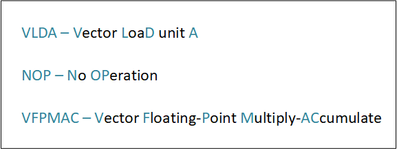
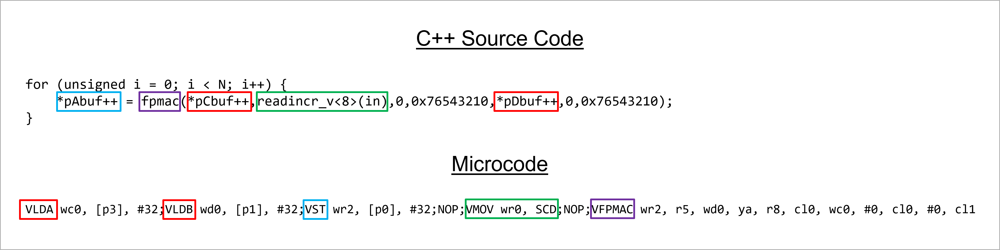

<!--
Copyright (C) 2024, Advanced Micro Devices, Inc. All rights reserved.
SPDX-License-Identifier: MIT
Author: Richard Buz
-->
<table class="sphinxhide" width="100%">
 <tr width="100%">
    <td align="center"><h1>AI Engine Development</h1>
    <a href="https://www.xilinx.com/products/design-tools/vitis.html">See Vitis™ Development Environment on xilinx.com </a>
    <a href="https://www.xilinx.com/products/design-tools/vitis/vitis-ai.html">See Vitis™ AI Development Environment on xilinx.com</a>
    </td>
 </tr>
</table>

# AI Engine Algorithm Performance Optimization

***Version: Vitis 2024.2***

## Table of Contents

- [AI Engine Algorithm Performance Optimization](#ai-engine-algorithm-performance-optimization)
  - [Table of Contents](#table-of-contents)
  - [Introduction](#introduction)
  - [Understanding Microcode](#understanding-microcode)
    - [Instruction Formats and Decoding](#instruction-formats-and-decoding)
    - [Load and Store Instructions](#load-and-store-instructions)
    - [Scalar Instructions](#scalar-instructions)
    - [Move Instructions](#move-instructions)
    - [Vector Instructions](#vector-instructions)
    - [Microcode Review](#microcode-review)
  - [Using the Vitis Analyzer](#using-the-vitis-analyzer)
    - [Locating Microcode](#locating-microcode)
    - [Measuring Performance](#measuring-performance)
  - [Common Optimization Opportunities](#common-optimization-opportunities)
    - [Bilinear Interpolation Example](#bilinear-interpolation-example)
    - [Register Spilling](#register-spilling)
    - [Pipelining Delay](#pipelining-delay)
    - [Restrict Pointers](#restrict-pointers)
    - [API Limitations](#api-limitations)
    - [Mapping to SIMD](#mapping-to-simd)
  - [Hands-On Application](#hands-on-application)
  - [References](#references)
  - [Support](#support)
  - [License](#license)

[References](#references)

[Support](#support)

[License](#license)

## Introduction

When mapping DSP algorithms to an AI Engine array, processing is divided and allocated to computational units called kernels. A kernel is simply a program that runs on a single AI Engine tile and is specified using C++ source code. For this tutorial, the term "algorithm" refers to a program composed of a single AI Engine kernel. Applications running on an AI Engine array may also be optimized at graph level, but that level of optimization is not addressed here.

Typical performance measures of interest are throughput and latency. There is also a relationship between runtime and required number of kernels or AI Engine tiles, so improving performance could also impact resource utilization. Using the AI Engine API to create C++ code that compiles and runs your algorithm is a straightforward process. However, what if the resulting performance is not adequate? As a DSP algorithm developer, there are questions that you must answer. Why is the provided kernel performance observed? Can this performance be improved? What steps can be taken to minimize the number of processing cycles?

Answers to these questions can be found in the microcode, an example of which is shown in Figure 1.

*Figure 1 - Example of AI Engine Microcode*

At first glance, it may appear like an incomprehensible string of characters. However, with the guidance presented in this tutorial, you will be able to analyze it. The two primary objectives of this tutorial are to help you understand the fundamentals of reading microcode to extract relevant information and to use this information to diagnose and improve compute efficiency. Additionally, two example labs are provided to encourage further hands-on experience with the process of using microcode to optimize AI Engine kernel performance.

## Understanding Microcode

To create effective kernel code using C++ and to understand the resulting microcode, it is important to have a rudimentary understanding of AI Engine architecture. This is provided in many AI Engine training courses, but a valuable reference to have on hand is the Versal Adaptive SoC AI Engine Architecture Manual ([AM009](https://docs.amd.com/r/en-US/am009-versal-ai-engine "AM009")).

Before digging into the specifics of using microcode for performance optimization, there are three things one should keep in mind.

- **Deciphering instruction mnemonics is a straightforward process**: Microcode instructions are presented in a mnemonic form representing their designated functions. By contextualizing these instructions, it is straightforward to determine their purpose. Some examples are shown in Figure 2.

   

   *Figure 2 - Microcode Instruction Mnemonics*

   If a mnemonic remains a mystery, using an AI based search engine can likely provide a correct interpretation, as many mnemonics are commonly used with different processing platforms.

- **You do not need to understand every detail of the microcode**: While microcode contains much detailed information, for the purpose of performance optimization it is helpful to learn how to focus only on what is relevant. To explain this concept further, refer to Figure 3.

   

   *Figure 3 - Focus on Relevant Microcode Details*

   The left side of the figure presents a detailed snippet of microcode. With familiarity and practice, you can mentally omit sections, indicated by the red line on the image’s right side. This selective approach allows you to focus on identifying cycles wasted between the loading of data into a register and the subsequent multiply-accumulate operation. To illustrate how this microcode might be used in performance optimization, the thought process to follow is:

  1. Notice that cycles are wasted between the time data is loaded and when it is used.
  2. Examine C++ source code to determine why this is occurring.
  3. Make required modifications to C++ source code to eliminate wasted cycles.

- **Learn to associate microcode with C++ source code**: Compiled C++ kernel code often has a direct association to generated microcode. An example is shown in Figure 4, where C++ source code consists of a loop containing a single `MAC` operation.

   

   *Figure 4 - Associate C++ Source Code with Generated Microcode*

   The red rectangles indicate data access via iterators in C++ source code. These operations are associated with the AI Engine memory interface and directly correspond to load instructions in microcode, also highlighted in red. Similarly, output is written using an iterator highlighted with a blue rectangle. This corresponds to a memory store operation and is reflected in microcode by the vector store operation highlighted in blue. Instructions highlighted with a green rectangle represent accessing data via the cascade interface. In microcode, cascade and stream interface operations result in move instructions, and as will be shown later, the mnemonic SCD refers to the input cascade interface. Finally, the `fpmac` AI Engine intrinsic function highlighted with a purple rectangle directly corresponds to the VFPMAC microcode instruction.

   By understanding AI Engine hardware architecture, you can create C++ kernel code and make direct associations to the generated microcode.

### Instruction Formats and Decoding

AI Engines provide instruction-level parallelism through a Very Long Instruction Word (VLIW) architecture. Full VLIW instructions are 128-bits in length and are composed of seven individual instruction slots (six slots in AIE-ML architecture). The general form of all possible full VLIW instructions is shown in Figure 5.

*Figure 5 - VLIW Instruction Format*

***Note*:** Two simultaneous vector load instructions are supported. They appear in the first two slots. Single store operations appear in the third slot. The fourth slot is where a single scalar operation is allocated. Slots 5 and 6 may contain move operations. Finally, vector processor instructions occur in slot 7.

Full VLIW instructions mostly occur in processing loops which take advantage of instruction-level parallelism. For other instructions in the main program, control code, preamble and postamble code, and outer loops, shorter instructions are supported since not all slots are required. In addition to the full 128-bit VLIW format, you may also observe 96-bit (5 slots), 64-bit (3 slots), 32-bit (2 slots), and 16-bit (no slots) instructions. Using shorter instructions where full VLIW parallelism is not required helps reduce program memory size, which is constrained to be less than a maximum of 16 kB. An illustration of how the AI Engine processes VLIW instructions is shown in Figure 6.

*Figure 6 - Decoding VLIW Instructions*

The instruction fetch and decode unit accesses the content of the program counter (PC) register and uses it to address program memory. It then expands the instruction returned from program memory into a full 128-bit VLIW instruction. Individual slots comprising the VLIW instruction are decoded into control signals and forwarded to corresponding functional units of the AI Engine. The following sections provide more detail on components comprising a VLIW instruction.

### Load and Store Instructions

AI Engines support two simultaneous load instructions from memory along with a single store instruction. Memory locations can be kernel input or output buffers, user-defined buffers in AI Engine tile memory, or the stack. An example of kernel code written in C++ that results in AI Engine load and store instructions is shown in Figure 7.

*Figure 7 - Kernel Code Resulting in Memory Load and Store*

Pointers shown are iterators assigned to memory locations. The dereferenced pointer highlighted in red provides input data to the vector multiplication operator, and directly corresponds to a vector load instruction. The pointer highlighted in blue accepts output of the cast operation and corresponds to a vector store instruction. Microcode generated from C++ source code can vary significantly due to different addressing modes supported, but the key information to focus on is when an operator occurs and possibly what the source and destinations are for the associated data. This is best illustrated through example, the first of which is shown in Figure 8.

*Figure 8 - Load Instruction Example 1*

Microcode shown on the left starts with `VLDA`, which indicates a vector load operation on unit A. The first argument following a microcode instruction is usually the destination of the operation output. Tables provided for this and following examples are taken from the Versal Adaptive SoC AI Engine Architecture Manual ([AM009](https://docs.amd.com/r/en-US/am009-versal-ai-engine)). In this case the destination of the loaded data is a 256-bit vector register `wr1`. The next argument specifies memory used to access data. In this case `sp` indicates that the stack is being accessed. In many microcode instructions you may notice numbers such as `#10` shown here. These are called immediate values and are just numeric constants coded into the instruction. For the purpose of optimizing performance these are generally not relevant. In this example, the number is likely related to incrementing the stack pointer. Figure 9 shows another load instruction example.

*Figure 9 - Load Instruction Example 2*

In this case `VLDB` indicates the vector load occurring is using unit B. The destination is a 256-bit vector register `wd0` and the memory source is specified by the content of a pointer register `p0`. Here, there is another immediate value likely used to adjust the pointer but is not relevant for optimization purposes. An example of a vector store operation is shown in Figure 10.

*Figure 10 - Store Instruction Example*

Microcode instruction `VST` indicates a vector store operation. This mnemonic is a little different since it has a number appended to it. By examining the destination, you can see that is is an accumulator register `aml3`. According to the Versal Adaptive SoC AI Engine Architecture Manual ([AM009](https://docs.amd.com/r/en-US/am009-versal-ai-engine)), AI Engine accumulator lanes may be 48-bits or 80-bits wide. Therefore, the instruction `VST.48` indicates that data is stored in an accumulator register with 48-bit wide lanes. The accumulator register `aml3.lo` has an extra term appended to it. The table shows that this accumulator register is 384-bits wide. Since there is a limit of 256-bit on the width of the memory interface, only half of the accumulator content may be written in a single clock cycle, so the destination `aml3.lo` indicates the lower half of the accumulator register. Finally, the data memory source is indicated by a pointer register `p6`.

### Scalar Instructions

The VLIW instruction provides a slot for operations executed on the scalar processor of the AI Engine. However, scalar operations are not very prevalent when focus is on single instruction, multiple data (SIMD) processing. Examples of scalar operations supported by AI Engine are shown in Figure 11.

*Figure 11 - Scalar Instruction Examples*

The format for standard ALU functions is shown at top-left, and a list of supported functions are provided in the table to the right. All ALU functions have a single cycle of latency. A scalar multiplication operator is provided for 32-bit numbers and provides a result with 3-cycle latency. The scalar processor also supports several non-linear functions. These operators have floating-point inputs and outputs, so type conversion is required when using fixed-point numbers. This is illustrated in the `SQRT` example, where fixed-point input data is provided in general purpose register `r5`. The conversion from fixed to floating-point is indicated by the appended suffix `FX2FLT`. When converting between fixed and floating-point numbers a shift value is required to specify the location of the binary point, and this is provided in shift control register `s2` in this example. The result is written to register `r1.FLT2FX` which indicates the required data type conversion back to fixed-point, and the associated shift value is provided in register `s3`. The `SINCOS` operator accepts a 32-bit argument from register `r10` and writes computed sin() and cos() in each 16-bit part of the 32-bit output register `r1`. Non-linear scalar functions have a 4-cycle latency. More detail on the scalar processor is provided in the Versal Adaptive SoC AI Engine Architecture Manual ([AM009](https://docs.amd.com/r/en-US/am009-versal-ai-engine)).

### Move Instructions

The largest category of VLIW components is the set of move instructions. One of the potential performance bottlenecks is getting data into and out of the AI Engine tile. While the memory interface used with load and store instructions is one method, there are two additional possibilities which are accomplished through move operations. Some examples of move operations associated with the stream interface are provided in Figure 12.

*Figure 12 - Stream Interface Move Examples*

Each AI Engine tile has two 32-bit input and two 32-bit output stream interfaces. However, the AI Engine itself has the option of using 128-bit interfaces as highlighted in yellow in the diagram. This is reflected in the examples shown, where `MOV` operations are used for the 32-bit interface and `VMOV` (V for vector) is used when the wider 128-bit interface is specified. There is also a nomenclature associated with the interfaces using letters M and S, likely derived from the master-slave interface idiom.

- `MS` refers to a 32-bit output stream
- `WMS` refers to a 128-bit (wide) output stream
- `SS` refers to a 32-bit input stream
- `WSS` refers to a 128-bit (wide) input stream

Since there are two streams in each direction to choose from, selection is specified in the `md0` mode control register. Finally, when writing to a stream, the value of `TLAST` is specified by the register in the final argument. Taking all this information into account, you can understand what the examples of microcode in the figure accomplish.

- Example 1: Send content of register `p4` to 32-bit output stream specified in `md0[10]`, with TLAST specified in register `r3`.
- Example 2: Send content of vector register `vrh2` to 128-bit output stream specified in `md0[10]`, with TLAST specified in register `r3`.
- Example 3: Read 32-bit input stream specified in `md0[8]` and store value in register `r6`.
- Example 4: Read 128-bit input stream specified in `md0[9]` and store value in vector register `vrh3`.

The final option for moving data into and out of an AI Engine tile are cascade interfaces. These are highlighted in yellow in Figure 13 along with two examples of microcode.

*Figure 13 - Cascade Interface Move Examples*

The output cascade stream is specified by `MCD` and the input stream is specified by `SCD`. Using this information, you can deduce what the microcode examples accomplish.

- Example 1: Send content of accumulator register `amh3` to the output cascade interface.
- Example 2: Read input cascade interface and store content in vector register `wc1`.

Move operations are also involved when performing shift-round-saturate (SRS), vector shifts, register splits, setting and getting register bits, and accessing and modifying vector lanes.

When using microcode to optimize performance, you should be able to identify the occurrence of register spilling. Register spilling occurs when register capacity is exceeded and data needs to be written to or read from the stack. Microcode examples showing evidence of spilling are provided in Figure 14.

*Figure 14 - Examples of Register Spilling*

While these mnemonics appear to be vector load and store operations, they are considered move operations and involve the stack rather than memory interfaces. These spilling operations also appear in the move operation slots of a VLIW instruction.

Register spilling is not always problematic. For example, a small lookup table may be stored on the stack and accessing this data could result in a `VLDA.SPIL` instruction. However, if both load and store spilling occurs within a single computational loop when register capacity is exceeded, this introduces additional cycles which negatively impact performance.

### Vector Instructions

Vector instructions are by far the most complex looking instructions. This is because many options are available in the vector processing units such as lane permutations and pre-adders. Fortunately, trying to determine all these details is unnecessary when using microcode to optimize performance. All that is required is to determine the operation being performed and possibly identifying the source and destination of the data. Some examples illustrating typical vector processing instructions are shown in Figure 15.

*Figure 15 - Vector Instruction Examples*

The first example shows vector multiplication. Recalling that accumulator lanes may be 48-bits or 80-bits wide, the instruction `VMUL.80` indicates 80-bit accumulator lanes. The product is stored in accumulator register `bm0` and operands are in vector registers `ya` and `wc0`. The suffixes on the registers, as well as other included terms in the expression may be ignored.

The second example uses the mnemonic `VMAC.48.SCD`. Based on previous information, it can be determined that this is a vector multiply and accumulate operation where the accumulator uses 48-bit wide lanes and `SCD` indicates the input cascade interface is involved. Examining the rest of the expression we see the result is written to accumulator `bm0` and there is a single vector register `ya` used to hold an input to the multiplier. Where does the other input to the multiplier come from? From the `SCD` mnemonic, you can deduce that it is provided by the input cascade interface.

The final example is a vector floating-point multiply and accumulate operation. Inputs are provided in vector registers `wr2` and `wc1`. Since the floating-point vector unit doesn't have a separate set of accumulator registers, the accumulator is specified by another vector register `wd0`.

### Microcode Review

All material on microcode presented up to this point provides more than enough knowledge to empower you to extract relevant information and use it to optimize your kernel code performance. As a review, imagine encountering the line of microcode shown in Figure 16. How would you use it to determine what is occurring in the AI Engine tile?

*Figure 16 - Microcode Review*

Individual slots of the VLIW instruction are delineated by semi-colons. Observe there are seven slots, so this is a full 128-bit VLIW instruction. It can be analyzed one slot at a time.

| Slot Number | VLIW Instruction | Description |
| ----------- | ---------------- |-------------|
| Slot 1      | `VLDA wd1, [p0], #32` | A vector load is occurring using unit A. Data is written to vector register `wd1`. The memory source is determined by the content of pointer register `p0`. You should be able to make the link to which particular memory is being accessed by referring to the C++ source code. |
| Slot 2 | `VLDB wd0, [p5], #32` | A simultaneous vector load is occurring using unit B. Data is written to vector register `wd0` and the memory source is specified by pointer register `p5`.|
| Slot 3 | `NOP` | The third slot in the VLIW instruction is for store operations. `NOP` indicates no store operation is occurring.|
| Slot 4 | `NOP` | The fourth slot is for scalar processor instructions. `NOP` indicates no scalar operations are occurring.|
| Slot 5 | `MOV.s12 lc, #26` | A move operation is occurring. Referring to the Versal Adaptive SoC AI Engine Architecture Manual ([AM009](https://docs.amd.com/r/en-US/am009-versal-ai-engine)), you can determine that a loop count register is involved.|
| Slot 6 | `MOV.s20 r12, #-5984` | Another move operation is in progress.|
| Slot 7 | `VFPMAC wd1, r2, wd1, ya, r8, cl0, wc1, #0, cl0, #1, cl1` | A vector floating-point multiply-accumulate operation is being performed. The content of vector registers `ya` and `wc1` are being multiplied and added to the content of vector register `wd1`. The result is stored in vector register `wd1`|

Now that you have the ability to interpret microcode, the next step is to examine how to apply it to identify opportunities to optimize kernel code performance.

## Using the Vitis Analyzer

While there are different places to access AI Engine microcode, AMD Vitis™ Analyzer [[2]] is a good choice when the goal is to optimize performance. The Vitis Analyzer can be opened as a standalone application or by using the Vitis IDE. Prior to using hte Vitis Analyzer for optimization, aiesimulator should be run with the `--profile` option enabled. This counts the number of times VLIW instructions are executed during simulation and is necessary to determine where time is spent during computation.

### Locating Microcode

Once you launch the Vitis Analyzer, microcode can be displayed by selecting **Profile > Profile Details**, highlighted in yellow in Figure 17.

*Figure 17 - Locating Microcode in Vitis Analyzer*

Sections highlighted in orange show how information is organized. Locating the kernel name isolates the section of microcode which performs the computations of your algorithm. The first column on the left shows how the program counter (PC) increments by the VLIW instruction length measured in bytes. To the right of the program counter, VLIW instructions expressed in hex format are displayed. The length of these hex strings corresponds to VLIW instruction length, where a full instruction corresponds to 16-bytes. The next section contains microcode which may be analyzed to perform optimization. One line of microcode is executed each clock cycle. Also very important are the columns containing execution and cycle counts for each VLIW instruction, which are used to derive performance measures of interest.

### Measuring Performance

Since much of the vector processing performed on AI Engines occur in loops, performance optimization may be summarized as the process of identifying these loops and minimizing the number of clock cycles required to execute them. A method of identifying loops in microcode is illustrated in Figure 18.

*Figure 18 - Measuring Latency and Initiation Interval (II)*

This kernel was executed 100 times, so many of the VLIW instructions have execution and loop counts of 100 as they were only executed once each time the kernel was invoked. Notice how there is a section where execution and loop counts have a much larger value of 12700. This block of VLIW instructions comprise a loop that is executed several times on each kernel invocation. Once loop boundaries are identified, performance measures may be derived.

One of the performance measures shown is latency. In this case it is measured as the number of cycles from the beginning of kernel execution until the first output of the loop is available. If this was the only loop in the kernel, latency would be interpreted as the number of cycles from the beginning of execution until the first kernel output is available. The other performance measure is initiation interval, often abbreviated as II. This is defined as the number of clock cycles between the launch of successive loop iterations. Another way of viewing kernel performance optimization is the process of reducing II of your computational loops.

## Common Optimization Opportunities

In the following sections, some of the more common issues impacting performance which are encountered when developing AI Engine kernels are introduced. A typical process of optimization is conveyed by working through an example of bilinear interpolation from the perspective of an algorithm developer who might be just getting started working with AI Engines.

### Bilinear Interpolation Example

Bilinear interpolation is a method of interpolating functions of two variables by using repeated application of linear interpolation in each dimension. It is commonly used in many applications such as image processing, computer vision, and geographic information systems [[3]]. The process of bilinear interpolation is illustrated in Figure 19 where, as shown on the left, a computed pixel value (red dot) is determined from surrounding reference pixels (green dots).

*Figure 19 - Computing Bilinear Interpolation*

A two-step process is performed by first interpolating in one dimension then the other. The first step, shown in the center, computes intermediate values (blue dots) using linear interpolation in the x-coordinate. The second step, shown on the right, uses intermediate results to perform a linear interpolation in the y-coordinate and derive the final interpolated value. Simplification of the interpolation equations shown may be realized by assuming spacing between reference pixels in a given dimension has a value of 1. This sets `$x_1 = y_1 = 0$, $x_2 = y_2 = 1$`, and the query point coordinates `$(x_q, y_q)$` specified by the fractional values `$(x_{frac}, y_{frac})$`. This results in the complete interpolation process being represented by a single dot product equation shown at the top of Figure 20.

*Figure 20 - Initial Attempt at Vectorization of Bilinear Interpolation*

To realize advantages of AI Engine processing, equations must be efficiently mapped to operations performed by a vector processor. An initial attempt is shown in the center of Figure 20, where a vector multiplication (MUL) is used twice. This is an element-wise vector multiplication that is first performed between a vector depending on `$x_{frac}$` and another depending on `$y_{frac}$`. The resulting product is then used in a second vector multiplication with the reference pixel values. Finally, a summing operation over all vector elements is performed to obtain the interpolated pixel value.

Another issue to consider is how to obtain the first two vectors from values of `$x_{frac}$` and `$y_{frac}$`. Modifying individual elements of a vector has a negative impact on performance, as it likely involves the scalar processor. The bottom of Figure 20 shows how these vectors may be derived using a multiply-accumulate (MAC) vector operation.

AI Engines can utilize either a fixed-point or floating-point vector processor. For this example, floating-point data types are used. As shown in the Versal Adaptive SoC AI Engine Architecture Manual ([AM009](https://docs.amd.com/r/en-US/am009-versal-ai-engine)), the floating-point vector processor can perform eight parallel multiplications. Also, a vector of eight floating-point values is 256-bits wide, which is a natural match to the memory interface. Due to these reasons, vectors of size 8 are used in kernel processing. Since the vectors shown in Figure 20 are of size 4, two pixel interpolations can be performed simultaneously using the floating-point vector processor. To get data into the kernel for processing, the format shown in Figure 21 is assumed.

*Figure 21 - Data Input for Bilinear Interpolation Kernel*

Each interpolated pixel requires six numbers for computation, namely `$x_{frac}$`, `$y_{frac}$`, and four reference pixel values. Since the smallest vector size that accommodates this is eight, two of the vector lanes are unused. Based on this mapping of the equation to the vector processor and memory interfaces, kernel code was created. The kernel header file is shown in Figure 22.

*Figure 22 - Initial Bilinear Interpolation Kernel Header File*

The header file defines the kernel class along with a member function that performs interpolation. It also defines constants used to compute vectors from `$x_{frac}$` and `$y_{frac}$` using a vector MAC operation, as shown in Figure 20. Implementation of the kernel function which performs interpolation is shown in Figure 23.

*Figure 23 - Initial Bilinear Interpolation Kernel Code*

A summary of the kernel code is as follows:

- Lines 19-20: Iterators are defined for input and output buffers. The input iterator is used to read vectors of size 16 which comprise two rows of the input format shown in Figure 21 and allows two pixels to be interpolated at a time. The output iterator is used to write a single interpolated pixel at a time.
- Lines 24-27: Load constant arrays defined in the header file into registers to be used to compute vectors from `$x_{frac}$` and `$y_{frac}$`.
- Line 29: Loop through input array, computing two interpolated pixels per loop invocation.
- Line 34: Read input data used to compute two interpolated pixels.
- Line 37: Compute vector based on `$x_{frac}$`. This is done using a floating-point MAC intrinsic function. Hex strings specify which vector lanes are used in computation. In this case, value `0xCCCC4444` extracts `$x_{frac}$` values from input for each pixel and assigns them to vector lanes for multiplication.
- Line 40: Similar computation as line 37 to derive vector based on `$y_{frac}$`.
- Line 43: Multiplication of vectors derived from `$x_{frac}$` and `$y_{frac}$` to compute `$xy$` product.
- Line 44: Multiplication of `$xy$` product with reference pixels.
- Lines 47-48: Extract half of vector corresponding to a single pixel and sum values. Resulting interpolated pixel value is written to output.

Simulation of this kernel with profiling was performed, and resulting microcode is examined in the following section.

### Register Spilling

Microcode generated from bilinear kernel C++ source code is displayed in Figure 24.

*Figure 24 - Microcode Indicating Register Spilling*

Examining the execution and cycle count columns, a computational loop is easily identified and determined to have an II of 41. Since two pixels are processed per loop invocation, computational efficiency can be specified as 20.5 cycles/pixel. Also highlighted is evidence of register spilling indicated by the `VLDA.SPIL` mnemonic in one of the move slots of the VLIW instruction. In this case, it's moving data from the stack to a vector register. Notice there is no store register spilling operation. Referring back to the C++ source code, one might deduce that the constant arrays used in computing vectors from `$x_{frac}$` and `$y_{frac}$` using a vector MAC operation might be the cause. Since register capacity is limited, each loop iteration these vectors are retrieved as needed for computation. Since register spilling is occurring, it is worth examining the source code, which is shown again in Figure 25.

*Figure 25 - Kernel Code with Indication of Register Use*

Highlighted variables show when vector registers are assigned values and when they are used in computation. In the case of floating-point vector operations there are no accumulator registers, so results are also written back to vector registers. Keeping in mind that only eight 256-bit vector registers are available, one can examine the size of variables and their persistence to determine the cause of spilling and find different ways of performing the computation to avoid it. Variables such as `xy` are assigned (line 43) then used on the next line, making efficient use of register space. In contrast, `vin` takes up the equivalent of two 256-bit registers and persists due to its use in several computations. In this particular example, register spilling does not seem to be an issue by requiring extra cycles to execute. However, if both load and store spilling operations occur in a loop, it is worth examining register usage to try to eliminate them.

### Pipelining Delay

Referring to Figure 24, one of the most noticeable aspects of the microcode is the presence of groups of lines with just a `NOP` assigned, meaning no new operations are being executed. One can understand how the presence of these lines of microcode negatively impacts performance, and it is useful to understand the cause. One of these sections of code is shown in Figure 26.

*Figure 26 - Microcode Indicating Pipeline Delay*

Notice that a vector floating-point multiplication is being executed with the result being written to vector register `wd1`. The content of `wd1` is moved to register `wc1` then used as input to the next vector multiplication. Why is there a 7-cycle gap between multiplications? This is answered by examining the floating-point processor architecture shown in Figure 27.

*Figure 27 - AI Engine Floating-Point Vector Processor*

This diagram illustrates a 7-stage pipeline. Recall that for each pixel the kernel first computes the product `xy` between vectors derived from `$x_{frac}$` and `$y_{frac}$`, then uses this result in a follow-on multiplication with the reference pixel values. Therefore, 7-cycle gaps observed in microcode are due to the vector processor waiting for the first product to make it through the pipeline before computing the next product. So, when you observe lines containing `NOP` between successive vector operations, it is likely an indication of pipeline delays. Many time this will be seven cycles for the floating-point processor. When using the fixed-point vector processor, there is a 6-stage pipeline.

To fill the pipeline, one tactic is to perform partial computation of your result for many input values and store them in a temporary buffer in local data memory. A follow-on loop would read that data and use it in the next stage of computation of the algorithm. Not only does this improve compute efficiency, but it often reduces the amount of register space used which eliminates register spilling.

Sometimes input data is required multiple times during kernel processing. If this data is in an input buffer, then it can be read multiple times as needed. If a kernel has stream inputs, then data could be sent multiple times as needed. To apply this to the bilinear interpolation kernel, computation is divided among four loops. The modified kernel header file is shown in Figure 28.

*Figure 28 - Modified Kernel Header*

Some changes to make note of are:

- Lines 18-19: The constant vectors are changed so that a single `MAC` operation uses `$x_{frac}$` and `$y_{frac}$` values for a single pixel instead one `MAC` using `$x_{frac}$` for two pixels and another `MAC` using `$y_{frac}$` values for two pixels.
- Lines 21-22: Buffers are created in local data memory to hold intermediate results.

Kernel code up to the end of the first computational loop is shown in Figure 29.

*Figure 29 - Modified Kernel Code Loop 1*

Points to note are:

- Line 19: The input iterator is of size 8 instead of 16. It will now read input data for a single pixel and use less register space.
- Line 22: An iterator is defined to access a memory buffer to hold intermediate data.
- Line 28: This loop processes one pixel per iteration.
- Line 36: The `fpmac` intrinsic function computes vectors derived from `$x_{frac}$` and `$y_{frac}$` and writes the result to local memory.

Kernel processing up to the end of the second loop is shown in Figure 30.

*Figure 30 - Modified Kernel Code Loop 2*

Point to note are:

- Lines 45-46: Iterators are define for both data memory buffers. The buffer containing data from the first loop is now of size 16, which means it can access two pixels worth of data.
- Line 48: This loop computes results for two pixels with each invocation
- Line 56: The permutation network of the floating-point processor is utilized through the `fpmac` intrinsic function to compute the first vector product for two pixels at a time. Results are stored in data memory.

The third loop computes the next vector product using kernel code shown in Figure 31.

*Figure 31 - Modified Kernel Code Loop 3*

Points to note are:

- Line 64: The input iterator is now defined to be of size 16. This is necessary to read the reference pixel values for two interpolated pixels
- Line 66: Computation for two interpolated pixels are performed with each loop invocation.
- Line 77: The next vector product is performed between the `xy` products stored in local memory and the reference pixel values retrieved from the input buffer. The vector product is written back to local memory.

The remainder of the kernel code containing the final loop is shown in Figure 32.

*Figure 32 - Modified Kernel Code Loop 4*

There is no significant change to the original kernel code except that the input for summing vector components is retrieved from data memory. Each loop invocation computes the final interpolated value for two pixels and writes them to the output buffer. Compiling and profiling this version of the kernel results in microcode containing four loops. The content of these loops is shown in Figure 33.

*Figure 33 - Microcode After Improving Pipelining*

The first two loops achieve excellent II values of 1 and 2, respectively. The third and fourth loops are candidates for further optimization if necessary. Since the first loop computes one pixel per iteration and the remaining loops compute two pixels per iteration, the compute efficiency of this implementation with improved pipelining is 16.5 cycles per pixel. This is an improvement over the original kernel code which required 20.5 cycles per pixel. Also, notice that the resulting microcode no longer shows signs of register spilling.

### Restrict Pointers

In the third loop in Figure 33, you can observe several consecutive lines of `NOP`. This time we observe the inactivity between the occurrence of load instructions into vector registers and when those registers are used in computation. The reason for this is that memory transactions take several cycles to complete, and the compiler cautiously creates code to wait for the completion of memory operations to avoid corruption due to multiple conflicting accesses. In this application you do not require this level of caution, so a C++ qualifier can be used to inform the compiler that the assigned pointer is the only way to access data and to perform more aggressive optimization. Specifically, this refers to the `__restrict` C++ qualifier which is applied to the kernel code shown in Figure 34.

*Figure 34 - Kernel Code with Restrict Pointers*

The red rectangles show the `__restrict` qualifier applied to input and output data buffers. Also, shown with by yellow rectangles are restrict pointers created using an AI Engine API function. These `begin_restrict_vector` iterators are assigned to buffers created in local data memory. When using restrict pointers it is the responsibility of the user to ensure multiple pointers do not access the same resource. Using restrict pointers in the kernel code results in microcode shown in Figure 35.

*Figure 35 - Microcode After Adding Restrict Pointers*

In this case there is a significant improvement in II for the third loop. Computational efficiency is now 10.5 cycles/pixel compared to the original kernel which required 20.5 cycles/pixel. At this point, if any further optimization is required, the fourth loop provides the best opportunity for gains in computational efficiency.

### API Limitations

The AI Engine API is the most reliable and portable approach to creating custom kernel code. In most cases there is no difference in performance between API and intrinsics functions. However, sometimes a programmer attempts to use API functions in a way that may result in non-optimal performance. Most likely this occurs when the API is applied to data that is extracted from a larger vector. When these events happen, it worth re-examining how compute is performed to determine if there is a more optimal way. Sometimes using intrinsic functions provide benefits. As an example, examine the fourth loop of the bilinear interpolation kernel, which is shown in Figure 36 along with generated microcode.

*Figure 36 - Kernel Code with Extract and Reduce Add*

The kernel extracts four elements from a vector of size 8 then adds the elements and sends the result to output. This operation is performed twice per loop invocation. Microcode indicates the following:

- `VFPMAC` operations are used to perform the addition.
- A 7-cycle gap between successive `VFPMAC` operations indicates a pipelining delay.
- It appears that a pair of `VFPMAC` operations is used to sum components for one interpolated pixel and is repeated for the second interpolated pixel.

Giving the objective of adding vector components some thought, an alternative solution is shown in Figure 37 based on intrinsic functions.

*Figure 37 - Microcode After Using Intrinsics for Reduce Add*

Intrinsic functions allow access to the permutation network of the floating-point vector processor. The objective of the code is illustrated by the diagram in the upper right corner where the vector on the left is the input with eight different elements represented by different colors. The kernel source code performs the following:

- Line 94: Add adjacent pairs of vector elements resulting in the vector shown in the center with four different color. After adding adjacent pairs, the elements with the same color have the same value.
- Line 95: Perform a second addition so the top 4 and bottom 4 elements have the same value. The value of these elements is the interpolated pixel value, so a single element from each group of four is selected to send to output.

The resulting microcode is also displayed indicating II has been reduced from 15 to 10. Combining this with the first three loops, the computational efficiency of the kernel code is now eight cycles per pixel compared to the initial value of 20.5 cycles per pixel.

### Mapping to SIMD

One of the most important things to consider is how algorithms get mapped to take advantage of SIMD processing. Considering the bilinear interpolation example up to this point, a mapping was initially assumed, and different optimizations were applied, but how the algorithm made use of the SIMD processor remained unchanged. Revisit this mapping based on the vectorization shown in Figure 38.

*Figure 38 - Original Vectorization for Bilinear Interpolation*

This approach attempts to use SIMD processing so that individual interpolated pixels are computed faster. To do so, data is first expanded across lanes (`$x_{frac}$`, `$y_{frac}$`) then SIMD processing is used for computation. To obtain the final result, data must be combined across lanes. In this example, the expansion of data didn't have much of an impact but the addition across lanes at the end did.

An alternative approach is to use individual vector lanes to process individual pixels. This pixel per lane approach would not speed up the processing for an individual pixel, but instead, several pixels would be computed at once. Mapping the bilinear interpolation equations to a pixel per lane approach is shown in Figure 39.

*Figure 39 - Pixel Per Lane Vectorization for Bilinear Interpolation*

The top three equations are the original linear interpolations performed over x and y coordinates. Expanding and rearranging terms in these equations leads to the lower set of equations. The reason this set of equations is attractive is that the first two terms in each equation represents a MAC operation. The result of this MAC is then used with the final term in a multiply and subtract from accumulator (MSC) operation. Using these equations with a pixel per lane means we can interpolate eight pixels using six vector operations. To facilitate this computation, the format of the input data is changed as shown in Figure 40.

*Figure 40 - Pixel Per Lane Input Format*

This format uses six 256-bit vectors for a group of eight pixels. Each group consists of a row for `$x_{frac}$`, a row for `$y_{frac}$`, and a row for each of the reference pixels. Note that this input format is also more efficient that the one introduced in Figure 21 since none of the vector elements are unused. Kernel code based on the pixel per lane approach is shown below with the first set of interpolations over the x coordinate shown in Figure 41.

*Figure 41 - Pixel Per Lane Kernel Code - Part 1*

Point to note are:

- Lines 19-20: Input iterator used to read in eight values at a time, or a single row shown in Figure 40. Output iterator used to write eight interpolated pixels at a time.
- Lines 23-26: Four work buffers are defined in local data memory.
- Lines 29-39: Perform MAC operations in x coordinate. Eight pixels processed per loop invocation. Results written to local data buffers.
- Lines 41-43: Iterators are reset prior to next processing loop.
- Lines 48-57: Perform MSC operations in x coordinate. Eight pixels processed per loop invocation. Results written to local data buffers.
- Lines 59-62: Iterators are reset prior to next processing loop.

Also worth noting is that although intrinsic functions are used, no use is made of lane permutations. So, using AI Engine API functions would be simpler in this case. The remaining kernel processing is shown in Figure 42.

*Figure 42 -  Pixel Per Lane Kernel Code - Part 2*

Points to note are:

- Lines 67-74: Perform MAC operation in y coordinate. Eight pixels processed per loop invocation. Results written to local data buffer.
- Lines 76-78: Iterators are reset prior to next processing loop.
- Lines 83-89: Perform MSC operation in y coordinate. Eight pixels processed per loop invocation. Eight interpolated pixel values written to output buffer.

Examining the kernel code also shows that previous principles of optimization introduced have been applied. Compiling and profiling this kernel code results in microcode comprised of the four loops shown in Figure 43.

*Figure 43 - Microcode for Pixel Per Lane Vectorization*

In this case the loops obtain II of 5, 4, 2, and 2. Since each loop now processes 8 pixels per invocation, the compute efficiency is now 1.625 cycles per pixel compared to 20.5 cycles per pixel we started with. That amounts to a 12.6 times improvement.

## Hands-On Application

As you gain experience working with AI Engine architecture and applying these principles of optimization, you will begin to create C++ kernel code that in many cases performs well without having to examine microcode. Whenever the need arises to analyze and improve performance, the knowledge gained through this tutorial should be sufficient to help achieve your objective. This process becomes more natural with experience, so to get hands on practice you might want to consider trying the [Optimization Practice Lab](OptimizationPracticeLab.md "Optimization Practice").

## References

[[1]]: Versal Adaptive SoC AI Engine Architecture Manual ([AM009](https://docs.amd.com/r/en-US/am009-versal-ai-engine)).

[[2]]: Vitis Accelerated Flow Reference Guide ([UG1702](https://docs.amd.com/r/en-US/ug1702-vitis-accelerated-reference)).

[[3]]: Bilinear interpolation. 16 Dec 2024, 22:13 UTC. In Wikipedia: The Free Encyclopedia. Wikimedia Foundation Inc. Encyclopedia on-line. Available from https://en.wikipedia.org/wiki/Bilinear_interpolation. Internet. Retrieved 19 December 2024.

## Support

GitHub issues will be used for tracking requests and bugs. For questions, go to [support.xilinx.com](http://support.xilinx.com/).

## License

Components: xilinx-images

images in the documentation

Components: xilinx-files

The MIT License (MIT)

Copyright (c) 2025 Advanced Micro Devices, Inc.

Permission is hereby granted, free of charge, to any person obtaining a copy
of this software and associated documentation files (the "Software"), to deal in the Software without restriction, including without limitation the rights to use, copy, modify, merge, publish, distribute, sublicense, and/or sell copies of the Software, and to permit persons to whom the Software is
furnished to do so, subject to the following conditions:

The above copyright notice and this permission notice shall be included in all copies or substantial portions of the Software.

THE SOFTWARE IS PROVIDED "AS IS", WITHOUT WARRANTY OF ANY KIND, EXPRESS OR
IMPLIED, INCLUDING BUT NOT LIMITED TO THE WARRANTIES OF MERCHANTABILITY,
FITNESS FOR A PARTICULAR PURPOSE AND NONINFRINGEMENT. IN NO EVENT SHALL THE
AUTHORS OR COPYRIGHT HOLDERS BE LIABLE FOR ANY CLAIM, DAMAGES OR OTHER
LIABILITY, WHETHER IN AN ACTION OF CONTRACT, TORT OR OTHERWISE, ARISING FROM, OUT OF OR IN CONNECTION WITH THE SOFTWARE OR THE USE OR OTHER DEALINGS IN THE SOFTWARE.

  &copy; Copyright 2025 Advanced Micro Devices, Inc.
